# Appendix A: Ethical Hacking Essential Concepts - I

## Operating System Concepts

### Windows OS

#### MS-Dos-based and 9x Windows OS Versions

- MS-DOS 1.0 - 2.0 - 2.1X - 3.0 - 3.1X
- Windows 95 - 98 - 98 SE - ME

#### NT Kernel-Based Windows OS Version

For PC:

- Windows NT 3.1 - 3.51 - 3.5 - 4.0
- Windows 2000 - XP - Vista - 7 - 8 - 8.1 - 10

For Server:

- Windows server 2003 - 2003 R2
- Windows Server 2008 - Windows Home Server - 2008 R2
- Windows Server 2012 - 2012 R2
- Windows Server 2016
- Windows Server 2019

### Windows Architecture

The processors of the Windows system work in two different modes for operation:

- User Mode
A collection of Sub-Systems.
Has limited access to resources.
- Kernel Mode
HAL, Kernel, executive.
Unrestricted access to system memory and external devices.

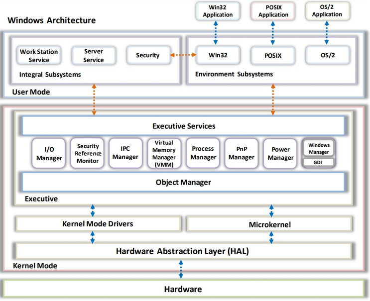

### Windows Commands

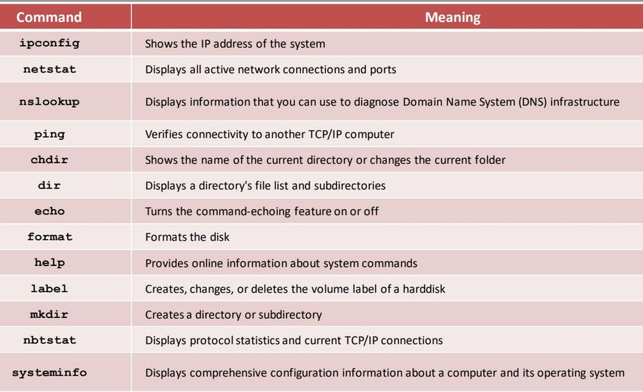

### UNIX OS

Three main components:

- kernel
- shell
- programs

All files are grouped together in the directory structure.

The file system is arranged in a hierarchical structure.

The top of the hierarchy is traditionally called **root** ("/")

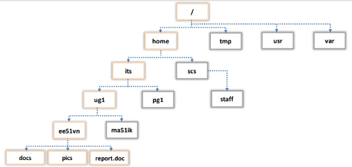

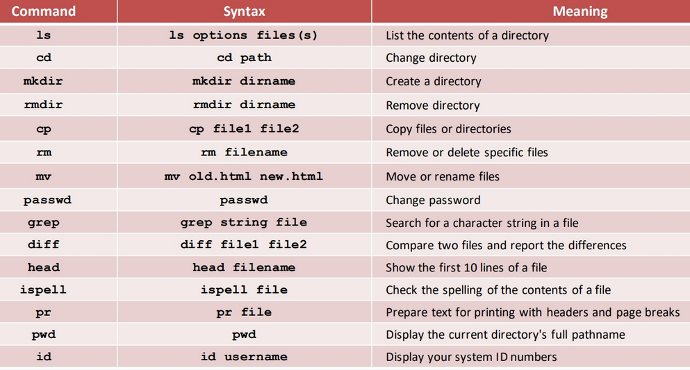

### Linux OS

Components:

- hardware
- kernel
- shell
- applications or Utilities
- system libraries
- daemons
- graphical server

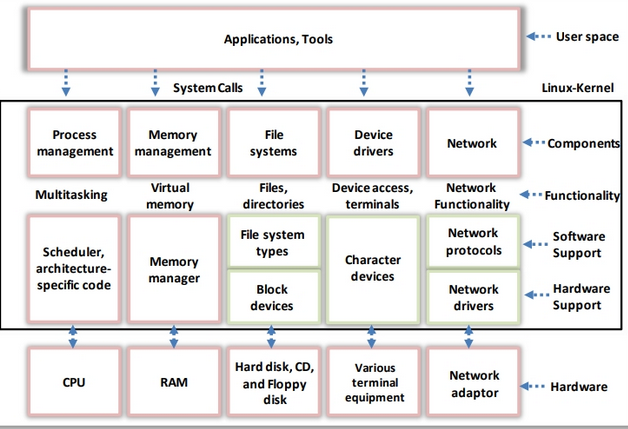

Features:

- portability
- open source
- multi-user
- multi-programming
- hierarchical file system
- shell
- security

### MAC OS X

... is a series of closed-source graphical os developed by Apple Inc.

... is the primary operating system for Apple's Mac computers.

Layers:

- cocoa application layer
- media layer
- core services layer
- core OS layer
- Kernel and Device Drivers layer

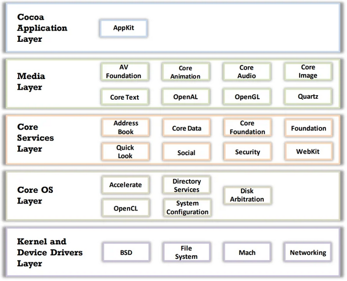

## File Systems

The ... is a set of data types that is employed for storage, hierarchical categorization, management, navigation, access, and recovering data.

... provide a mechanism for users to store data in a hierarchy of files and directories.

... includes a format for specifying the path to a file.

... is organized in the form of tree-structured directories.

Major ... include:

- FAT
- NTFS
- HFS+
- APFS
- Ext2
- Ext3
- Ext4
- others

Types of File Systems:

- shared disk
- disk
- network
- database
- flash
- tape
- special purpose

### File Allocation Table (FAT)

... is used with DOS

... was the first FS used with Windows OS

... is placed at the beginning of the volume.

... contains three different versions:

|System|Bytes per cluster|Cluster limit|
|---|---|---|
|FAT12|1,5|Fewer than 4.087|
|FAT16|2|4.087 - 65.526|
|FAT32|4|65.526 - 268.435.456|

FAT32 is derived from a FAT file system and supports drives up to 2 terabytes in size.
It uses drive space efficiently and uses small clusters.
It crete backups of the FAT instead of using the default copy.

### New Technology File System (NTFS)

... is the standard FS of windows >= NT

... includes several improvements.

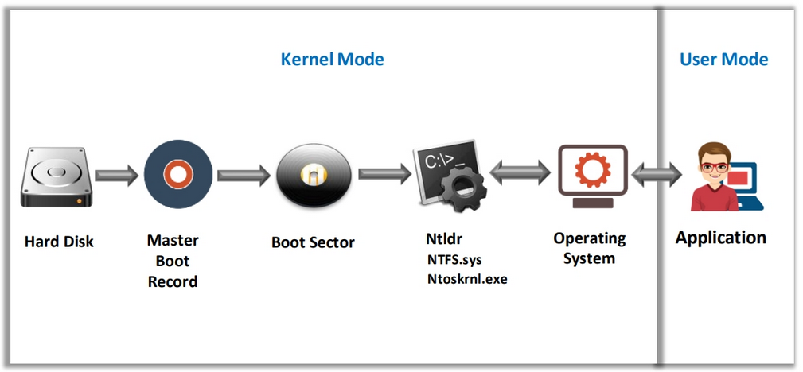

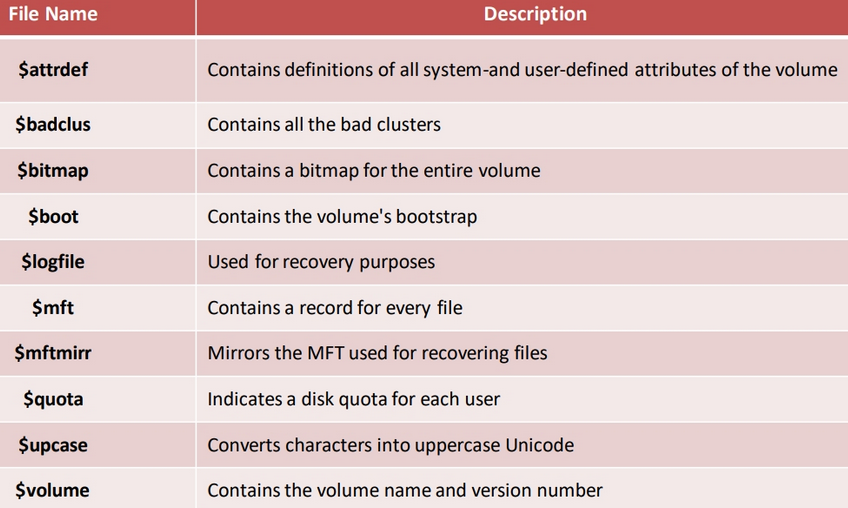

### Encrypting File Systems (EPS)

... was first introduced in version 3.0 of NTFS.

This encryption technology maintains a level of transparency to the user who encrypted the file: is no need for users to decrypt the file and access it for making changes.

To enable the encryption and decryption facilities, a user has to set the encryption attributes of the files and folders.

### Sparse Files

... provide a method of saving disk space for files.
If an NTFS file is marked as sparse, it assigns a hard disk cluster only for the data defined by the application.

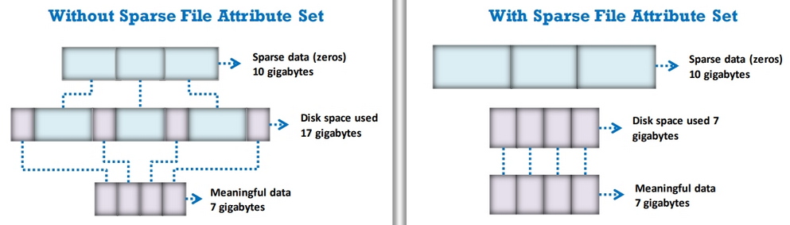

### Linux File Systems

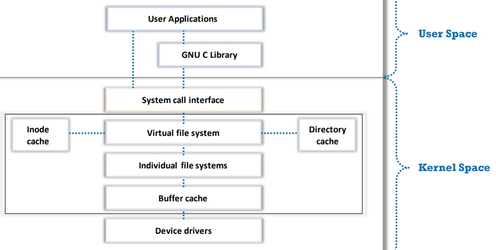

#### Filesystem Hiearchy Standard (FHS)

... defines the directory structure and its contents.
All files and directories are present under the root directory.

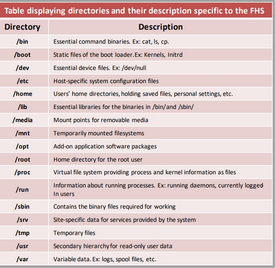

#### Extended File System (EXT)

... was the first file system for the Linux OS.

... has a maximum partition size of 2 GB and a maximum file name size of 255 characters.

The major limitation of this file system is that it doesn't support separate access, inode modification, or data modification time stamps.

#### Second Extended File System (EXT2)

... uses improved algorithms and maintains additional time stamps.

... maintains a special field in the superblock that keeps track of the file system status.

... its shortcomings are the risk of FS corruption when writing to EXT2, and that it is not a journaling file system.

#### Third Extended File System (EXT3)

... is an enhanced version of the EXT2 file system.

... is uses file system maintenance utilities for maintenance and repair, like the EXT2 FS.

Features:

- data integrity
- speed
- easy transition

#### Fourth Extended File System (EXT4)

... is a journaling FS

... has significant advantages over EXT3 and EXT2 FS, in terms of performance, scalability, and reliability

### Mac OS X File Systems

1. Hierarchical File System (HFS)
2. HFS plus
3. Unix File System (UFS)

## Computer Network Fundamentals

Standard Network Models:

- OSI Model
- TCP / IP model

### Open System Interconnection (OSI) Model

... is the standard reference model for communication between two end users in a network.

... comprises seven layers, of which the top four layers are used when a message transfers to or from a user and the lower three layers are used when a message passes through the host computer.

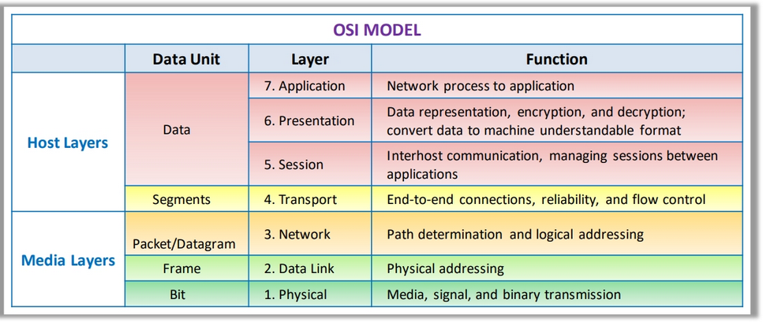

### TCP / IP Model

... is a framework for the Internet Protocol suite of computer network protocols that defines the **communication in an IP-based network**.

#### Functions

Handles high-level protocols, representation issues, encoding, and dialog control.

Constitutes a logical connection between the endpoints and provides transport services from the source to the destination host.

Selects the best path through the network for packets to travel.

Defines how to transmit an IP datagram to other devices on a directly attached network.

#### Layers

- Application layer
- Transport layer
- Internet layer
- Network Access layer

#### Protocols

- File transfer (TFTP, FTP), Email (SMTP), Remote login (Telnet, rlogin), Network management (SNMP), Name management (DNS)
- Transmission control protocol (TCP), and User datagram protocol (UDP)
- Internet protocol (IP), Internet control message protocol (ICMP), Address resolution protocol (ARP)
- FDDI, Token Ring, CDP, VTP, PPP

### Comparing OSI and TCP / IP

TCP / IP model is based on the practical implementation of protocols.

OSI model is a generic protocol-independent standard. It defines services, intervals, and protocols.

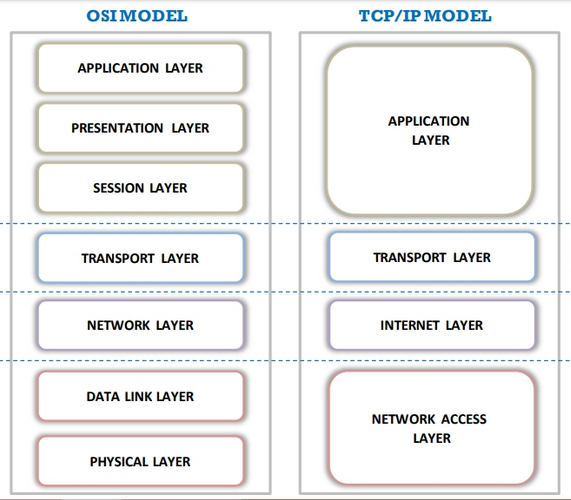

### Types of Networks

Classification of networks based on the physical location or the geographical boundaries:

- Local area network (LAN)
- Wide area network (WAN)
- Metropolitan area network (MAN)
- Personal area network (PAN). Wireless communication that uses both radio and optical signals. Covers individual's work area or work group (room-size network)
- Campus area network (CAN). Covers only a limited geographical area
- Global area network (GAN). A combination of different interconnected computer networks. The Internet is an example of...

### Wireless networks (WLAN)

... use Radio Frequency (RF) signals and the ISEE standard of 802.11, and radio waves for communication.

Advantages:

- installation is easy and eliminates wiring
- access can be from anywhere within the range of an access point
- public places can offer constant Internet connection

Limitations:

- wi-fi security may not meet expectations
- the bandwidth is impacted by the number of users
- wi-fi standard changes may require replacing wireless components
- some electronic equipment can interfere with the wi-fi network

#### Wireless standards

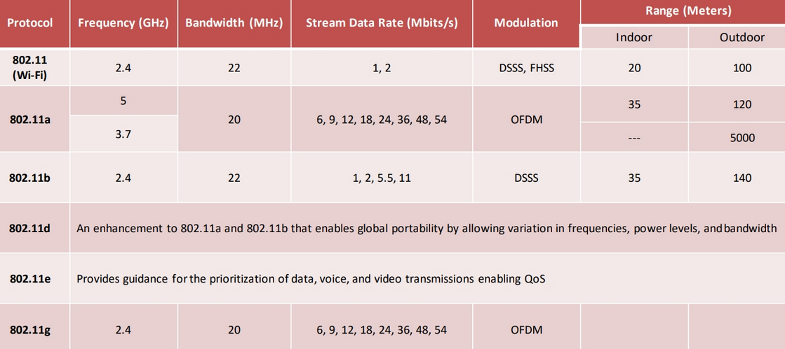

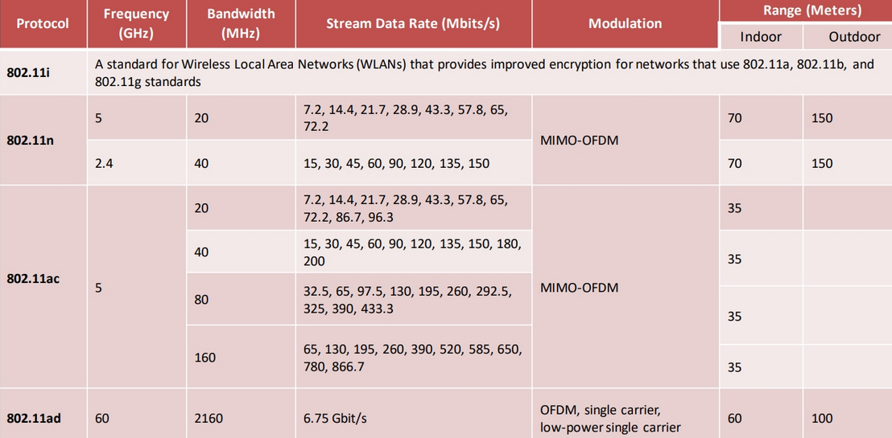

#### Wireless Technologies

**Worldwide Interoperability for Microwave Access (WIMAX)** is a wireless communication standard based on the IEEE 802.16 family.
It is a standardized wireless version of Ethernet that provides broadband access to wireless mobile.
It works as an alternative to wire technologies.
... signals can function over a long distance with higher data rates.
It provides high-speed data, voice, video calls, and Internet connectivity to users.

**Microwave Transmission** is a form of wireless communication that uses high frequency radio waves.
It is widely used in point-point communications.
... offers a very large information-carrying capacity owing to its huge bandwidth.
A major limitation is its ability to transmit data only within line of sight.

**Optical Wireless communication (OWC)**

... is a form of unguided transmission through optical carriers.

... uses visible, infrared (IR) and ultraviolet (UV) ranges of light:

- Visible light communication (VLC)* operates in the visible band (390-750 nm). ... use light-emitting diodes.
- Point-to-point OWC systems (known as free space optical systems) transmit at IR frequencies (750-1600 nm). ... use laser transmitters.
- ultraviolet communication (UV) operates within the solare blind UV spectrum (200-280 nm).

**2G**

... is the second generation of mobile cellular network under the standard **Global system for Mobile communications (GSM)**. ... uses digitally encrypted signals.
A combination of 2G and **GPRS** forms its advanced version, 2.5G.
Later **Enhanced Data Rates for GSM Evolution (EDGE)**, alias 2.75G, succeeded the GPRS.

**3G**

... is the third-generation wireless technology that was launched as a **Universal Mobile Telecommunications Service (UMTS)** network.
The first version is **High-Speed Packet Access (HSPA)**, the last version is **High Speed Packet Access (HSPA+)**, alias 3.5G.

**4G**

... known as **Long Term Evolution (LTE)**, is a fourth-generation.
All capabilities defined by the International Telecommunication Union (ITU) and International Mobile Telecommunications-Advanced.
... offers transmission rates of 100Mbit/s for high-mobility communication and 1Gbit/s for low-mobility communication.

**Terrestrial trunked radio (Tetra)**

... is a European standard that describes a professional mobile radio communication infrastructure.
... is a standard for Private Mobile radio (PMR) and Public access mobile radio (PAMR) that is aimed at emergency users and transport services.
The low frequency permits coverage of a large geographic area with fewer transmitters.

**Bluetooth**

... is a short-range (up to 10 meters) device-to-device data transmission technology.
... transfers data at less than 1 Mbps and operates within a frequency range of 2.4 Ghz to 2,485 Ghz.
... comes under IEEE 802.15.

### Network topologies

... is a specification that deals with a network's overall design and flow of its data.

Types of...

#### Physical

The physical layout of nodes, workstations and cables.


#### Logical

The information flow between different components.

### Network Hardware Components

- Network Interface Card (NIC)
- Repeater
- Hub
- Switch
- Router
- Bridges
- Gateways

### Types of LAN technology

#### Ethernet

... is the physical layer.
... describes the number of conductors required for making the connection, determines the required performance thresholds, and offers the framework for data transmission.
... can send data at a rate of up to 10 Mbps
... standard is IEEE standard 802.3

#### Fast Ethernet

... standard is IEEE 802.3u transmits data at a minimum rate of 100 Mbit/s.

3 types:

1. 100BASE-TX (level 5 UTP cable)
2. 100BASE-FX (fiber-optic cable)
3. 100BASE-T4 (extra two wires with a level 3 UTP cable)

#### Gigabit Ethernet

... standard IEEE 802.3-2008 ... Ethernet frames at a speed rate of 1 gigabit per second.

It is used for multimedia and Voice over IP (VOIP).

... also called *Gigabit-Ethernet-over-copper* or 1000Base-T, its speed is ten times more than 100Base-T.

#### 10 Gigabit Ethernet

IEEE 802.3ae-2002

10 gigabit per second

... uses optical fiber connections.

#### Asynchronous Transfer Mode (ATM)

... is a cell-based fast-packet communication standard

... operates on the *data link layer*

... used on private long-distance networks

#### Power over Ethernet (PoE)

IEEE 802.3af and 802.3at

... allows the Ethernet cables to supply power to network devices over existing data connection.

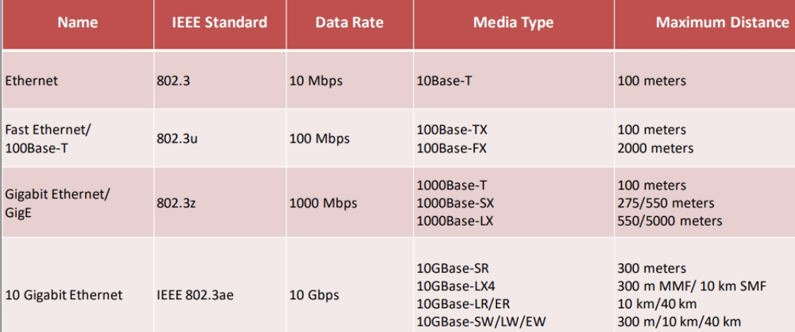

### Common Fiber Technologies

#### Fiber Optic Cable

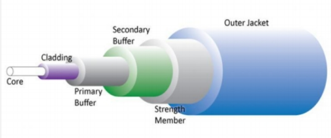

Components:

- core consists of glass or plastic with higher index of refraction
- cladding ... but with lower refractive index
- buffer protects the fiber from damage
- jacket holds one or more fibers in a cable

Features:

- lower cost
- wide bandwidth
- lighter - weight and small
- more secure
- resistant to corrosion
- longer life and easy to maintain
- elimination of cross-talk
- immune to electrostatic interference

#### Coaxial Cable

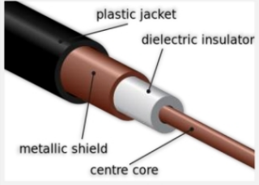

Advantages:

- cheap installation cost
- great channel capacity
- good bandwidth
- easily modifiable
- cheap production cost

#### CAT 3

Used in 10Base-T Ethernet

Bandwidth of 16 MHz

Attenuation of 11.5 dB

Impedance of 100 ohms

#### CAT 4

Used in 10Base-T Ethernet

Bandwidth of 20 MHz

Attenuation of 7.5 dB

Impedance of 100 ohms

#### CAT 5

... has a maximum length of 100 m

... supports frequencies up to 100 MHz

Used in suitable for 10Base-T, 100Base-TX, and 1000Base-T

Bandwidth of 100 MHz

Attenuation of 24.0 dB

Impedance of 100 ohms

#### CAT 5 e

Used in fast ethernet (100 Mbps), Gigabit Ethernet (1000 Mbps), and 155 Mbps ATM

Bandwidth of 350 MHz

Attenuation of 24.0 dB

Impedance of 100 ohms

#### CAT 6

Used in Gigabit Ethernet (1000 Mbps), and 10 Gigabit Ethernet (10000 Mbps)

Bandwidth of 250 MHz

Attenuation of 19.8 dB

Impedance of 100 ohms

#### 10 Base-T

... has a maximum transmission speed of 10 Mbps and a maximum cable length of 100 m

... uses 802.3i IEEE standard

... uses 4 wires (pins 1, 2, 3, 6)

#### 100 Base-T

... has a maximum transmission speed of 100 Mbps

... uses 802.3u IEEE standard

... uses 4 wires (pins 1, 2, 3, 6)

#### 1000 Base-T

... has a maximum transmission speed of 1000 Mbps

... uses 802.3ab IEEE standard

... uses 8 wires (pins 1, 2, 3, 4, 5, 6, 7, 8)

### TCP / IP Protocol Suite

#### Application Layer: Dynamic Host Configuration Protocol (DHCP)

#### Application Layer: Domain Name Server (DNS)

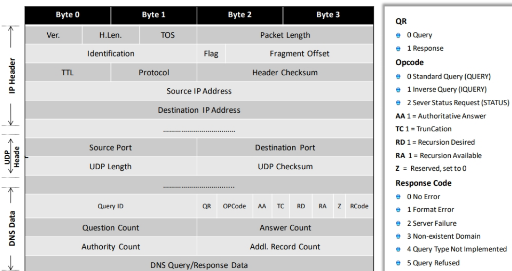

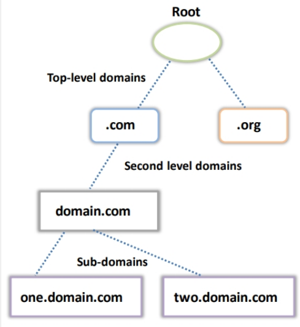

#### Application Layer: Domain Name System Security Extensions (DNSSEC)

... is a suite of the Internet Engineering Task Force (IETF)
... is used for securing certain types of information provided by DNS
... works by digitally signing records for DNS lookup.

It guarantees:

- authenticity
- integrity
- the non-existence of a domain name or type

It does not guarantee:

- confidentiality
- protection against Denial of Service

> *Delegation Signing (DS) records* provide complete information about a signed zone file.

#### Application Layer: Hypertext Transfer Protocol (HTTP)

Weaknesses in HTTP:

- vulnerable to man-in-the-middle attacks
- a data sent via HTTP are not encrypted
- can be used without any encryption or digital certificates

#### Application Layer: Secure HTTP (S-HTTP)

... is an alternate for the HTTPS (SSL) protocol.
... is generally used in situations where the server requires authentication from the user.

Not all browsers and servers support S-HTTP

#### Application Layer: HyperText Transfer Protocol Secure (HTTPS)

The connection is encrypted using the Transport Layer Security (TLS) or Secure Sockets Layer (SSL) protocol.

... protects against man-in-the-middle attacks.

... can be vulnerable to Decrypting RSA with Obsolete and Weakened eNcryption (DROWN) attacks. 

#### Application Layer: File Transfer Protocol (FTP)

TCP Port 21

... uses SSL / TLS and SSH encryptions for data security.

... uses two connections:

- control connection
- data connection

... supports two modes of operation:

- active mode (control connection is made from the client, data connection from the server)
- passive mode (both the connections are made from the client)

#### Application Layer: Secure File Transfer Protocol (SFTP)

TCP Port 22

#### Application Layer: Trivial File Transfer Protocol (TFTP)

... only reads and writes files from or to a remote server.

Weaknesses:

- vulnerable to Denial of service
- " to directory traversal

#### Application Layer: Simple Mail Transfer Protocol (SMTP)

TCP port 25

two types of model:

- end to end
- store and forward

Features:

- mail forwarding
- mail gatewaying
- mail relaying
- address debugging
- mailing list expansion

Advantages:

- ... provides the simplest form of communication through mail
- quick mail delivery
- ... is reliable for outgoing email messages
- easy to connect. Flexible with existing applications
- several platforms support
- low implementation and administration cost

Disadvantages:

- weakest security
- limited to 7 bit ASCII chars
- lack the security protocols specified in X.400
- usefulness is limited owing to its simplicity

#### Application Layer: Secure Multipurpose Internet Mail Extensions (S/MIME)

... is used to send digitally signed and encrypted email messages

... uses **RSA** for its digital signature and **DES** for message encryption

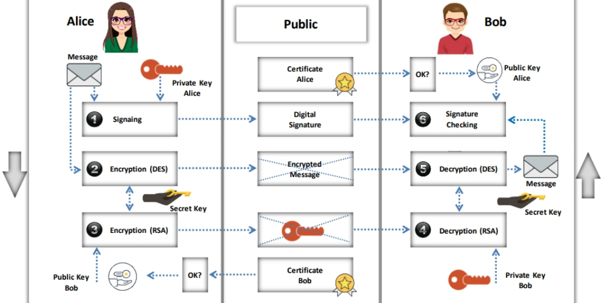

#### Application Layer: Pretty Good Privacy (PGP)

... provides *cryptographic privacy* and authentication for network communication

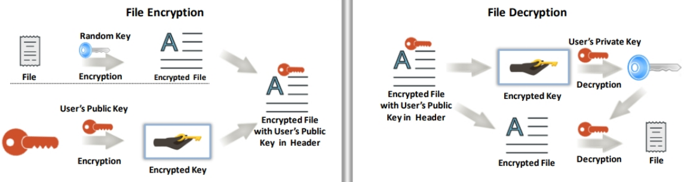

|Mandatory Features                     |S/MIME v3                                  |OpenPGP                                    |
|---                                    |---                                        |---                                        |
|Message Format                         |Binary, Based on CMS                       |Application/Pkcs 7-mime                    |
|Certificate Format                     |Binary, Based on X.509v3                   |Binary, Based on previous PGP              |
|Symmetric Encryption Algorithm         |Triple DES (DES, EDE3, and CBC)            |Triple DES (DES, EDE3, and Eccentric CFB)  |
|Signature Algorithm                    |Diffie-Hellman (X9.42) with DSS or RSA     |ElGamal with DSS                           |
|Hash Algorithm                         |SHA-1                                      |SHA-1                                      |
|MIME Encapsulation of Signed Data      |Choice of Multipart/signed or CMS Format   |Multipart/signed ASCII armor               |
|MIME Encapsulation of Encrypted Data   |Application/Pkcs 7-mime                    |Multipart/Encrypted                        |
              
#### Application Layer: Telecommunications network (Telnet)

... is a TCP/IP protocol used on a LAN that helps a user to access remote computers over a network

Advantages:

- logging on to a remote computer and executing programs
- controlling web servers remotely
- fast and efficient even when the network and system loads are high

Weaknesses:

- vulnerable to DoS
- vulnerable to Packet sniffing
- is not secure: all data in clear text
- vulnerable to eavesdropping attacks

#### Application Layer: Secure Shell (SSH)

... builds a secure, encrypted tunnel for exchanging information between the network

Authentication mechanism:

1. simple -> user password
2. key-based -> generate a public and a private key (ssh-keygen -t rsa)
3. host-based

#### Application Layer: Simple Object Access Protocol (SOAP)

... is an XML-based messaging protocol.
... provides data transport for web services and is independent of both platform and language

... has *extensibility*, *neutrality*, *independence*

... is equivalent to RPC, used in DCOM and COBRA

Weaknesses:

- statelessness
- to much reliance on HTTP
- slower than CORBA, RMI, or IIOP due to the lengthy XML format
.. depends on WSDL and does not have any standardized mechanism for dynamic discovery of the services

#### Application Layer: Simple NEtwork Management Protocol (SNMP)

... manages a TCP/IP based network

... can collect and manage the information about the devices (routers, hub modems, printers, bridges, switches, servers and workstations)

Risks to Cisco IOS SNMP configurations:

- DDoS attacks
- SNMP Remote Code Execution

#### Application Layer: Network Time Protocol (NTP)

... is used to synchronize the clock times of computer in a network

The NTP client initiates a time request exchange with the NTP server

Features:

- uses UTC as a reference time
- highly scalable

Weaknesses:

- vulnerable to DoS and DDoS attacks
- intruders can intercept the packets between an authentic client and server
- intruders can replay one or more packets

#### Application Layer: Remote Procedure Call (RPC)

... is a protocol that allows inter-process communication between client and server without having to understand the network's details.

Recent RPC vulnerabilities on Windows and Linux platform:

- Microsoft Windows RPC Security Bypass
- Microsoft RPC DCOM Interface Overflow
- Microsoft Windows RPC CVE-2017-8461 Remote Code Execution
- Multiple Linux Vendor rpc.statd Remote Format String
- Port 111 rpcbind

#### Application Layer: Server Message Block (SMB) Protocol

... is used to provide shared access to files, printers, serial ports, and other

... provides an authenticated inter-process communication mechanism

... works through a client-server approach

The Microsoft SMB Protocol is often used with is NetBIOS over TCP/IP (NBT).

The enhanced version of ... called Common Internet File System (CIFS) was developed by Microsoft for open use on the Internet.

#### Application Layer: Session Initiation Protocol (SIP)

... is used for signaling and controlling real-time multimedia sessions that involve communication applications

... determines user attributes like user location, user availability, user capability, session setup and session management.

#### Application Layer: Remote Authentication Dial-In User Service (RADIUS)

... provides centralized authentication, authorization, and accounting (AAA) for the remote access servers to communicate with the central server.

Authentication Steps:

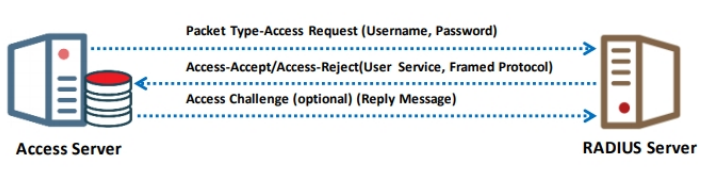

Accounting Steps:

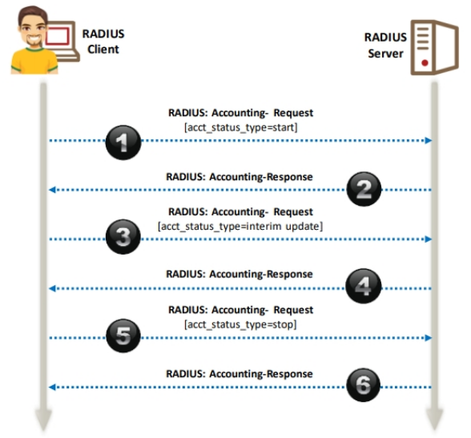

#### Application Layer: Terminal Access Controller Access-Control System Plus (TACACS+)

... is used for AAA for network devices like switches, routers, and firewalls through one or more centralized servers.

... encrypts the entire communication

Security issues:

- no integrity checking
- vulnerable to replay attacks
- accounting information is sent in clear text
- weak encryption

#### Application Layer: Routing Information Protocol (RIP)

... is a Distance Vector routing protocol

... uses Internet Protocol (IP)

Features:

- performs IP and IPX routing
- makes use of UDP port 520
- the administrative distance of RIP routes is 120
- has a maximum hopcount of 15 hops

#### Transport Layer: Transmission Control Protocol (TCP)

... breaks messages into segments, reassembles them at the destination station, and resends the packets that are not received at the destination.

Protocols that use TCP include:

- FTP
- HTTP
- Telnet
- SMTP

TCP header format:

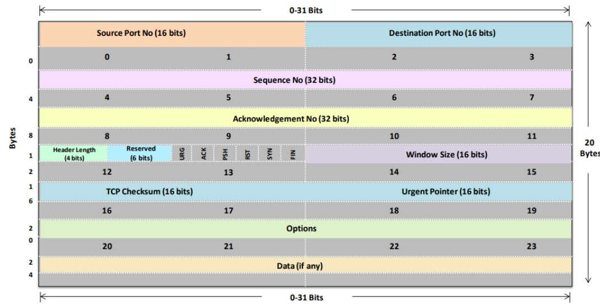

Services:

1. Simplex
Each flow has its own window size, sequence numbers, and acknowledgement numbers.
2. Half-duplex
Allows sending information in both directions but only one direction can be utilized at a time.
3. Full-duplex
Allows data flow in each direction, independent of the other direction.

#### Transport Layer: User Datagram Protocol (UDP)

... is a connection-less transport protocol that exchange datagrams without acknowledgements or guaranteed delivery.

... not uses windowing or acknowledgements

Protocols that use UDP include:

- TFTP
- SNMP
- DHCP

#### Transport Layer: Secure Socket Layer (SSL)

... developed by Netscape for managing the security of message transmission on the Internet.

... is used to provide a secure authentication mechanism between two communicating applications.

... requires a reliable transport protocol, such as TCP, for data transmission.

... uses **RSA asymmetric (public key) encryption**.

#### Transport Layer: Transport Layer Security (TLS)

... is used to establish a secure connection and ensure the privacy and integrity of information during transmission.

... uses a symmetric key for bulk encryption, an asymmetric key for authentication and key exchange, and message authentication codes for messages integrity.

... uses the RSA algorithm with 1024-bit and 2048-bit strengths

#### Internet Layer: Internet Protocol (IP)

... is a fundamental network layer protocol in the TCP / IP protocol suite.
It is primarily responsible for sending datagrams across network boundaries.

IP header format:

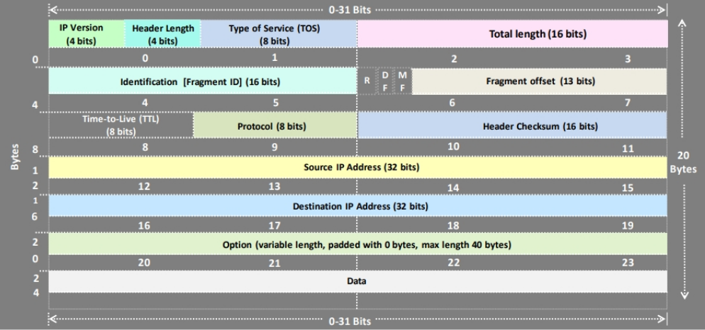

... has a protocol field that specifies whether the segment is TCP or UDP

#### Internet Layer: IPv6

... also called IPng, next generation protocol

- it can store a larger address space in comparison to IPv4
- contains both *addressing* and *controlling data* or *information* to route packets for next-generation Internet
- has more security features built into its foundation than IPv4

Features:

- expandable address space and routing capabilities
- scalable to new users and services
- auto configuration ability
- mobility
- end-to-end security
- extension headers
- authentication and privacy
- support for source demand routing
- quality of service (QoS)

IPv6 header format:

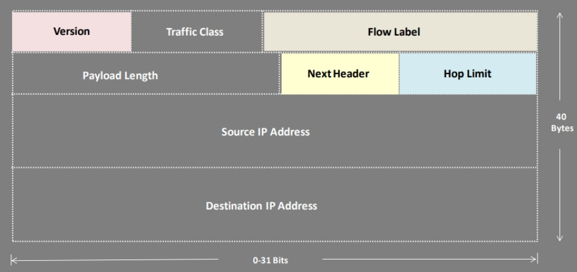

IP transition mechanism:

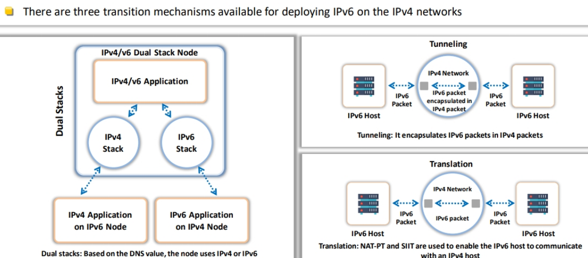

The transitions can be used in any combination.

IPv4 vs IPv6

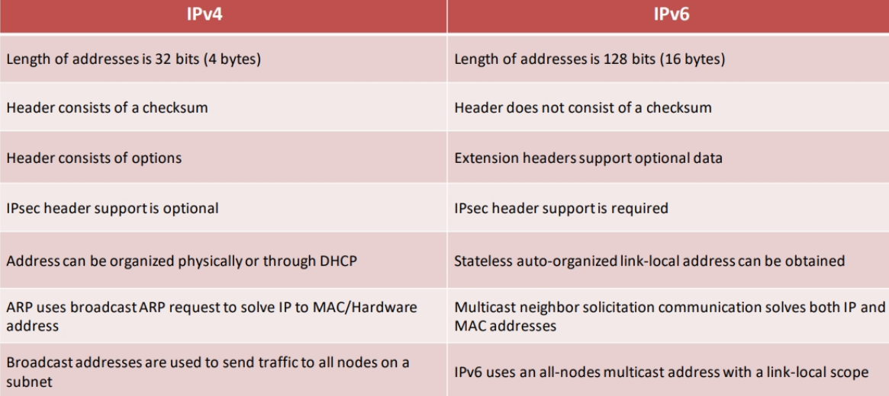

#### Internet Layer: Internet Protocol Security (IPsec)

... is a set of protocols, developed by Internet Engineering Task Force (IETF) to support the secure exchange of packets at the IP layer.

... ensures interoperable **cryptographically-based security** for IP protocols, and supports network-level peer authentication, data origin authentication, data integrity, data confidentiality, and replay protection.

... is widely used to implement **virtual private networks**

#### Internet Layer: Internet Control Message Protocol (ICMP)

... is an unreliable method for the delivery of network data.
It does not notify the sender of failed data transmission.
... is the component of the TCP / IP protocol stack that addresses this basic limitation of IP.
... does not overcome the unreliability issues in IP

When datagram delivery errors occur, ICMP reports the errors back to the source.

ICMP messages are encapsulated into the datagram.
Encapsulation uses the same technique IP uses to deliver data.
Error reports could generate more error reports.
This causes increased congestion within an already ailing network.
It is possible to have a datagram delivery error that is never reported back to the sender of the data.

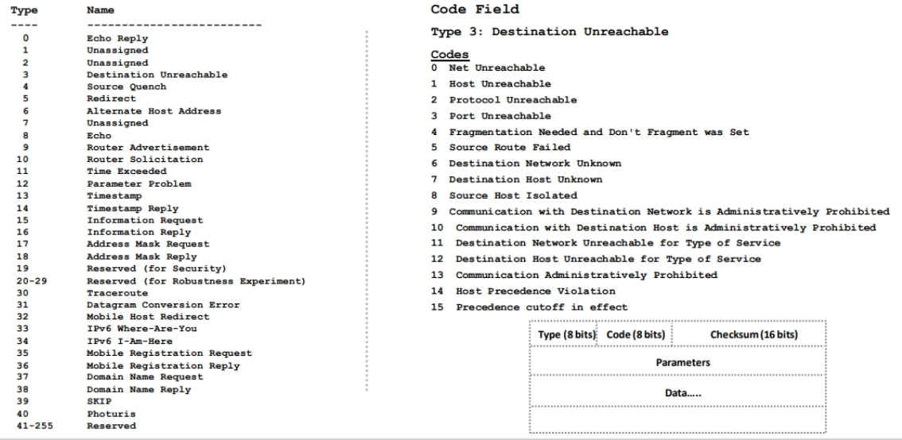

#### Internet Layer: Address Resolution Protocol (ARP)

... is a stateless protocol used for resolving IP addresses to machine (MAC) addresses.

An ... request is *broadcast* over the network, whereas the response is a *unicast* message to the requester.

The IP address and MAC pair are stored in the system, switch, or router's *ARP cache*, through which the ARP reply passes.

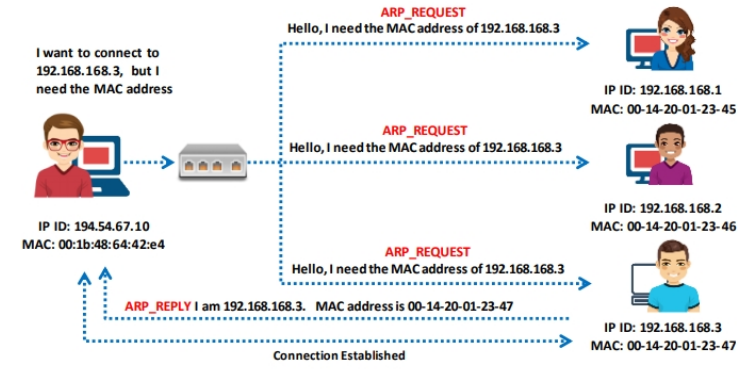

#### Internet Layer: Interior Gateway Routing Protocol (IGRP)

... is a Distance-Vector protocol, developed for transmitting routing data within the Internet networks

... calculates the distance metric by using Bandwidth and Delay of the Line, by default.

Characteristics:

- periodic routing updates every 90 seconds
- includes a full routing table after every periodic update
- broadcast updates
- neighbors
- defines the finest path to a specific destination through the Bellman-Ford Distance Vector algorithm

Features:

- performs only IP routing
- makes use of IP protocol 9
- the administrative distance of IGRP routes is 100
- has a maximum of 100 hops, by default

#### Internet Layer: Enhanced Interior Gateway Routing Protocol (EIGRP)

Hybrid routing protocol: Distance-Vector and Link-State routing protocols.

... ...

#### Internet Layer: Open Shortest Path First (OSPF)

An Interior Gateway Protocol (IGP) for the Internet

It is also a link-state routing protocol.

Creates and maintains three different tables:

1. neighbor table
2. topology table
3. routing table

#### Internet Layer: Hot Standby Router Protocol (HSRP)

A Cisco-developed redundancy protocol used to etablish a fault-tolerant default gateway.

It is designed for multi access or broadcast LAN.

It gets automatically self updated when the MAC address is modified.

It can be vulnerable to DoS attacks.

#### Internet Layer: Virtual Router Redundancy Protocol (VRRP)

... provides for automatic assignment of available Internet Protocol (IP) routers to participating hosts.

... provides information on the state of a router.

If the physical router that is routing packets on behalf of the virtual router fails, another physical router is selected automatically to replace it.

#### Internet Layer: Border Gateway Protocol (BGP)

... manage packets across the internet through the exchange of information between host gateways or autonomous systems.

BGP4 is the current version for internet routing. It helps Internet service providers (ISPs) to determine the routing of packets between each other.

#### Link Layer: Fiber Distributed Data Interface (FDDI)

... supports voice and multimedia communication

The optical standard for transferring data by means of fiber optics lines in a LAN up to 200 km

Transfers data at the rate of 100 Mbps

Composed of two fiber optic rings:

- primary works in the network
- secondary acts as backup and takes the position of primary ring in the case of network failure

**Token ring**

LAN that connects multiple computers using a transmission link in either a **ring topology** or **star topology**.

Data flow is always **unidirectional**.

#### Link Layer: Cisco Discovery Protocol (CDP)
#### Link Layer: VLAN Trunking Protocol (VTP)
#### Link Layer: Spanning Tree Protocol (STP)
#### Link Layer: Point-to-point Protocol (PPP)

#### IP Addressing and Port Numbers: Internet Assigned Numbers Authority (IANA) 

IANA is responsible for the global coordination of DNS Root, IP addressing and other Internet protocol resources.

The well-known ports are assigned by IANA and can only be used by the system (or root) processes or by programs executed by privileged users on most systems.

The registered ports are listed by the IANA and can be used by ordinary user processes or programs executed by ordinary users on most systems.

The IANA registers the uses of these ports as a convenience to the community.

The range for assigned ports managed by the IANA is **0-1023**.

#### IP Addressing

An IP Address is a unique numeric value assigned to a node or a network connection:

- 32-bit binary number
- set of four numbers or octets ranging between 0 to 255
- numbers are separated by periods
- known as dotted-decimal notation

#### Classful IP Addressing

IP addresses are divided into 5 major classes

... was the first addressing scheme of the Internet, it managed addressing through classes A, B, C, D, E

An IP address can be broken down into two parts:

- the first part represents the network
- the second part represents a specific host on the network

#### Address Classes

- A
 - 8-bit network prefix
 - starts with binary address 0, the decimal number can be anywhere between 1-126
 - the first 8 bits identify the network, the remaining 24 bits specify hosts
- B
  - 16-bit prefix
  - starts with binary address 10, the decimal ... 128-191
  - the first 16 bits identify the network
- C
  - 24-bit
  - starts with 110, ... 192-223
  - the first 24 bits
- D
  - starts with 1110, ... 224-239
  - supports multi-casting
- E
  - starts with binary 1111, ... 240-255
  - reserved for experimental use

Classes - Networks and hosts

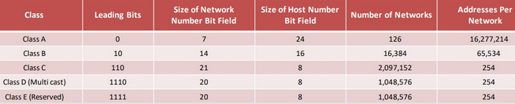

Classes - Characteristics and uses

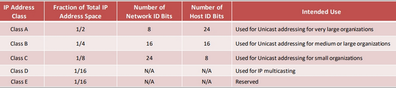

#### Subnet Masking

... divides the IP address of the host into network and host numbers

... allows the division of Class A, B, and C into smaller segments

A Variable length subnet mask (VLSM) allows two or more subnet masks to exist in the same network

VLSM effectively uses IP address space in the network

#### Sub-netting

... allows you to divide a Class A, B, or C network into different **logical subnets**

To subnet a network, use some of the bits from the host ID portion, in order to extend the natural mask:

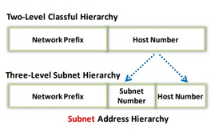

#### Super-netting

- class A and B addresses are in the depletion stage
- class C provides only 256 hosts in a network
- super-netting combines various class C addresses and creates a super network
- it applies to class C addresses
- also known as classless inter-domain routing (CIDR), it was invented to keep IP addresses from exhaustion
- the super-net mask is the reverse of the subnet mask

#### IPv6 Addressing

Based on the standard specified by the RFC 4291.

Allows multilevel sub-netting

Support unicast, anycast, and multicast addresses

IPv6 address space is organized in a hierarchical structure

128-bit addresses

Hexadecimal notation, separated by colons

#### Port numbers

TCP and UDP use port numbers to pass information to the upper layers

Port numbers are used to keep track of different conversations crossing the network simultaneously

Conversations that do not involve an application with a well-known port number are assigned port numbers that are randomly selected

Some ports are reserved in TCP and UDP

End systems use port numbers to select the correct application for handling the communication

Assigned ranges:

- numbers below 1024 are considered well-known port numbers
- numbers above 1024 are dynamically assigned
- registered port numbers are those registered for vendor-specific applications

#### Network terminology: routing

... is the process of selecting the best paths in a network to forward data packets. It is usually performed by a dedicated device

The process is based on routing tables

- static
The table is manually created, maintained, and updated
- dynamic
The table is created, maintained, and updated by a routing protocol running on the router

#### Network terminology: Network Address Translation (NAT)

... is a network protocol used in IPv4 networks that allows multiple devices to connect to a public network using the same public IPv4 address.

Port numbers for protocols that use internal IP addresses (TCP, UDP) remain unchanged.

Benefits:

- conserves IPv4 addresses
- hides the internal network's IP
- simplifies routing
- supports a wide range of services
- consumes fewer computer resources

#### Network terminology: Port Address Translation (PAT)

... permits different ports in multiple devices on LAN to be mapped to a single public IP address.

... is also known as port overloading, port-level multiplexed NAT, or single address NAT

#### Network terminology: Virtual local area network (VLAN)

... is a group of networks which are **logically connected to the same wire** and communicate with each other despite being **physically located in different geographical locations**.

... are configured through **software**

... is cheaper than creating a routed network

Advantages:

- number of devices is reduced
- managing devices become less complex
- increases security options
- performance and security
- formation of virtual workgroups
- simplified administration

Disadvantages:

- VLANs rely on switches to do right thing
- packet leaks from one VLAN to the text
- injected packets meant for an attack

Security implications:

- keeps host separated by VLAN and limits the number of devices that can talk to these hosts
- increases security options
- controls inter-VLAN routing using IP access lists
- deploys VTP domain, VTP pruning, and password protections

#### Network terminology: Shared Media Network

Each node in the network shares a single channel and bandwidth for communication.

Every message reaches every node in the shared media network.

Advantages:

- cheap
- no switch
- short response time
- broadcasting or multi-casting is easy
- simple design

Disadvantages:

- fixed channel bandwidth
- need a router or gateway to go beyond each segment
- limited distance span
- traffic problems and collisions
- security issues

#### Network terminology: Switched Media Network

Point-to-point communication is established through a dedicated line.

The communication needs switches to establish direct connection.

Advantages:

- high bandwidth
- no collision

Disadvantages:

- expensive
- complex design
- long response time
- security issues

### Basic Network Troubleshooting

#### Unreachable Networks

Network communications depends on certain basic conditions being met:

- devices must have the TCP/IP protocol stack properly configured:
  - IP address
  - subnet mask
  - gateway
- router must have the TCP/IP protocol properly configured on its interfaces

#### Destination Unreachable Message

An ICMP destination unreachable message is sent if:

- datagrams cannot be forwarded to their destinations
- packet fragmentation is required in order to forward a packet
- IP-related services, such FTP or web services, are unavailable

#### ICMP Echo (Request) and Echo Reply

```bash
utente@host:~$ ping 192.168.1.1
PING 192.168.1.1 (192.168.1.1) 56(84) bytes of data.
64 bytes from 192.168.1.1: icmp_seq=1 ttl=64 time=0.379 ms
64 bytes from 192.168.1.1: icmp_seq=2 ttl=64 time=0.328 ms
64 bytes from 192.168.1.1: icmp_seq=3 ttl=64 time=0.262 ms
64 bytes from 192.168.1.1: icmp_seq=4 ttl=64 time=0.253 ms
64 bytes from 192.168.1.1: icmp_seq=5 ttl=64 time=0.359 ms
64 bytes from 192.168.1.1: icmp_seq=6 ttl=64 time=0.277 ms
64 bytes from 192.168.1.1: icmp_seq=7 ttl=64 time=0.268 ms

--- 192.168.1.1 ping statistics ---
7 packets transmitted, 7 received, 0% packet loss, time 119ms
rtt min/avg/max/mdev = 0.253/0.303/0.379/0.051 ms
```

#### Time Exceeded Message

A TTL value is defined in each datagram (IP packet).

As each router processes the datagram, it decreases the TTL value by one.

When the TTL of the datagram value reaches zero, the packet is discarded.

ICMP uses a ... to notify the source device that the TTL of the datagram has been exceeded.

#### IP parameter problem

If the header of the datagram contains an error, not related of the destination host or network, an ICMP type 12 parameter problem message is sent to the source.

#### ICMP Control Messages

... are used to inform hosts of conditions such as:

- network congestion
- existence of a better gateway to a remote network

#### ICMP redirects (type = 5, Code = 0 to 3)

The default gateway only sends the ... request messages if the following conditions are met:

- router is configured to send redirects
- route for the redirect is not another ICMP redirect or default route
- the interface through which the packet comes into the router is the same interface through the packet gets routed out
- the subnet / network of the source IP address is the same of the next-hop IP address of the routed packet
- datagram is not source-routed

#### Troubleshooting

... the network is the process of finding the issue in the computer network and diagnosing it.

Typical network issues:

- physical connection
- connectivity
- configuration
- software
- traffic overload
- network IP

#### Troubleshooting: IP problems

- using tools, locate the devices that raised the issue
- check the physical connections
- LAN connectivity faults can raise network connectivity issues
- at each hop, check whether the router is working
- ensure the proper configuration settings of the devices

#### Troubleshooting: local connectivity issues

- ping the destination
- ping the gateway
- if ping fails, check the route followed by subnet mask
- if is OK, check if the source is pinging a hop/router
- if the ping fails, it could be a configuration issue or a repetitive IP issue
- resolve repetitive IP issue by disconnecting the doubtful device

#### Troubleshooting: physical connectivity issues

- check for cable
- check for faulty port
- check for traffic overload

#### Troubleshooting: routing problems

- using traceroute tool locate the hop or router responsible
- ...

#### Troubleshooting: upper-layer faults

Common problems:

- firewall blocking the flow
- the server or a service is down
- authentication process issues result in the inability to access a service
- issues with the software compatibility of the devices

#### Troubleshooting: wireless network connection issues

- ...

#### Network troubleshooting tools

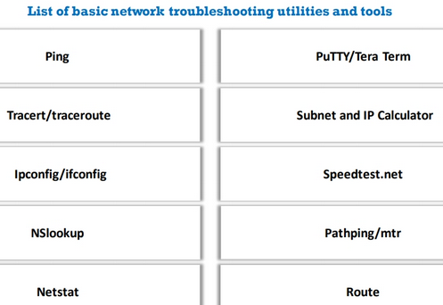

...

**NSlookup** utility is used to lookup a specific or multiple IP address when a user can access a resource by specifying its IP address, but cannot access it by its DNS name.

```bash
$ nslookup www.google.it
Server:		192.168.1.20
Address:	192.168.1.20#53

Non-authoritative answer:
Name:	www.google.it
Address: 216.58.208.131
Name:	www.google.it
Address: 2a00:1450:4002:807::2003
```

**Netstat** is a command line utility used to display both the incoming and outgoing traffic of TCP/IP.
It is used to identify the services associated with user defined ports.

**Pathping** is used to give detailed information about the path characteristics from a specific host to a specific destination

### Virtualization

After ... a hardware platform is used to run multiple operating systems and their applications.

#### Characteristics

1. partitioning
2. isolation
3. encapsulation

#### Benefits

- resource efficiency
- reduced disk space consumption
- business continuity
- migration
- increase in uptime
- increased flexibility
- improved quality of services
- environmental benefits

#### Common vendor

- VMware
- Citrix
- Oracle
- Microsoft

#### Security and concerns

Securing:

- the virtual environment
- each virtual machine at the system level
- the virtual network

Concerns:

- it is difficult to monitor unusual events and anomalies due to the additional layer of infrastructure complexity
- offline can be used as a gateway to gain access
- the workload can easily be moved to a new virtual machine with a lower level of security

#### Virtual firewall

... is a software that monitor and control packets transmitted between VMs.
Runs completely in the virtual environment.

Functions in two (n.2) modes:

- bridge-mode, resides at the inter-network virtual switch
- hypervisor-mode resides at the virtual machine monitor

#### Virtual Operating systems

Advantages:

- additional hw not required
- efficient usage of system resources
- replicates most major host OS's services

Limitations:

- it consumes many host resources
- calls must pass through the host OS's which minimizes performance

#### Virtual databases

... is a type of database management system that allows users to query various databases simultaneously by treating them as a single entity.

Advantages:

- sharing the overload of larger db of similar environment
- simplifies the migration of db
- allows dynamic and automated deployment of new system instances and resources
- increases the availability of db by isolating virtual db and switching to another when one is down

Disadvantages:

- require huge amounts of resources
- creates complexity for the db admin
- difficult solving issues with a virtual db

### Network File System (NFS)

... is a distributed file system protocol.

The file system works on all IP-based networks and uses TCP / UDP for data access and delivery.

... offers two (n.2) types of security:

- host level (access control) refers to restricting certain operations when the remote user does not provide correct credentials
- file level (operational) refers to limiting actions on the files in a mounted file system

Methods of securing access controls:

- root squashing. Limiting superuser access privileges
- nosuid. Does not allow the SUID or SGID to take effect on this filesystem
- noexec. Prevents the execution of files from this partition

### Web markup and programming languages

#### HTML

#### XML

Derived from Standard Generalized Markup Language (SGML).

#### Java
#### .Net
#### C#
#### JSP
#### ASP
#### PHP
#### Perl

Practical Extraction and Report Language

#### JavaScript
#### Bash scripting
#### PowerShell
#### C and C++
#### CGI

Common Gateway Interface is the standard way for a web server to connect to external applications.

... is supported by many web servers and is language independent.

### Application Development Frameworks and Their Vulnerabilities

#### .Net Framework Vulnerabilities

- remote code execution
- DoS
- feature bypass
- modifying the framework core (.NET assembly tampering)

#### J2EE Framework Vulnerabilities

- bypass cross-site scripting (XSS)
- execute arbitrary programs
- DoS
- Sensitive information disclosure

#### ColdFusion Vulnerabilities

Is built on Java and uses the Apache Tomcat J2EE container.

- directory traversal
- ColdFusion CSRF
- ColdFusion DoS
- Unvalidated browser input
- CFFILE, CFFTP, and CFPOP

#### Ruby On Rails Vulnerabilities

- remote code execution
- authentication bypass
- DoS
- directory traversal
- XSS

#### AJAX Vulnerabilities

- increased attack surface
- browser-based
- XSS
- mashup and widget hacks
- CSRF
- XML and JSON based
- SQL injection
- XPATH injection

### Web Subcomponents

Web applications have three (n.3) primary components:

- web browser (or client)
- web application server
- database server

#### Thick and Thin Clients

Thin is deployed on a central server location.

Thick is independent of a central processing server.

Smart clients (rich clients) use web services to communicate with server-based applications.

#### Applet
#### Servlet
#### ActiveX
#### Flash application

### Database connectivity

#### SQL server

Web application uses the following connection methods when connecting to an SQL server:

- Connection string
- OLE DB file (.UDL)
- ODBC Data Source Name (DSN)

Two (n.2) type of authentication modes:

- Windows authentication
- mixed

Data controls:

- data controls (DAO)
- ADO data controls with DSN, UDL, programmatically
- Remote Data Object (RDO)
- ODBC direct
- ODBC

#### Microsoft Access
#### MySQL
#### ORACLE
