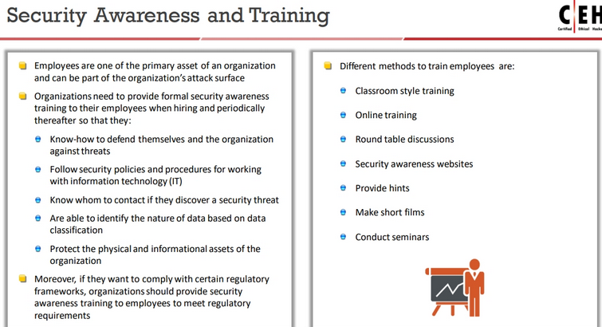
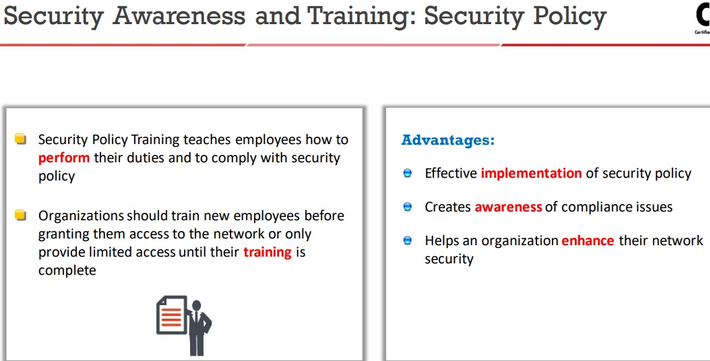
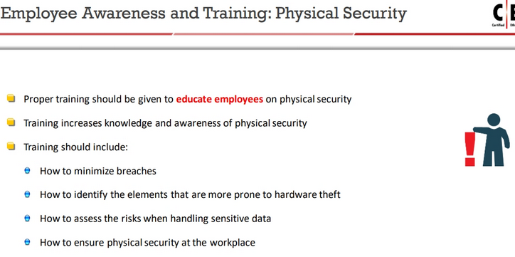
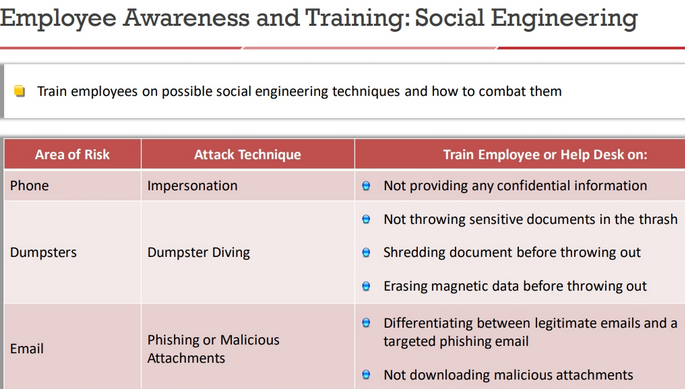
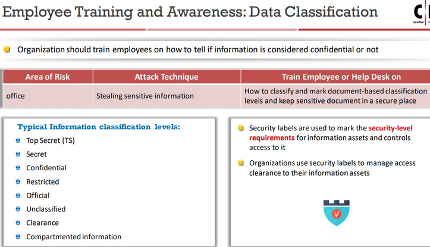
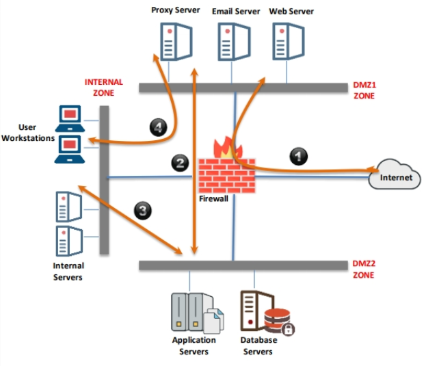
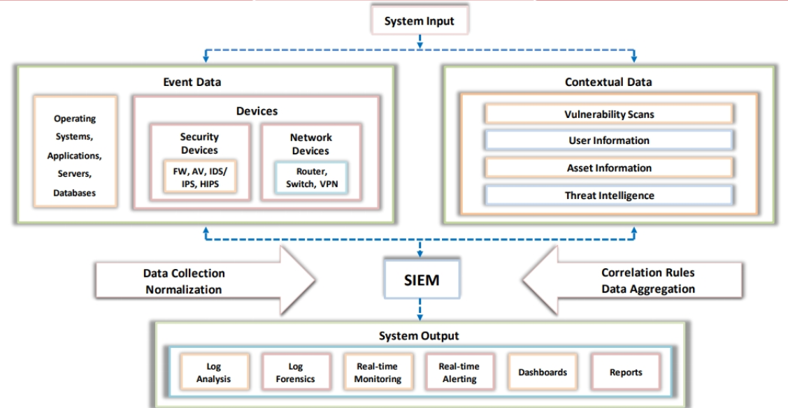

# Appendix B: Ethical Hacking Essential Concepts - II

## Information Security Management Program

... designed to enable a business to operate in a state of reduced risk.

## Enterprise Information Security Architecture (EISA)

... is a set of requirements, processes, principles, and models that determines the structure and behavior of an organization's information systems.

Goals:

- monitor and detect network behaviors in real time
- detect and recover from security breaches
- monitor various threats
- benefits organization's budget in cost prospective
- identify assets
- helps to perform risk assessment

## Information Security Controls

### Administrative Security Controls

... are the administrative access controls implemented by the management to ensure the safety of the organization.

Examples:

#### Regulatory Framework Compliance

... a collaborative effort between governments and private bodies to encourage voluntary improvements to cybersecurity.

#### Information Security Policy

... is the foundation of security infrastructure.

... defines the basic security requirements and rules to be implemented in order to protect and secure an organization's information systems.

Types of...:

- promiscuous
- permissive
- prudent
- paranoid

Examples:

- access control
- remote access
- firewall management
- network connection
- passwords
- user account
- information protection
- special access
- email security
- acceptable use

Privacy policies at the Workplace

HR implications of Security Policy Enforcement

Legal Implications of Security Policy Enforcement

#### Employee Monitoring and Supervising

None

#### Information Classification

None

#### Security Awareness and Training

#### Separation of Duties (SoD)

Conflicting responsibilities create unwanted risks

Regulations such as GDPR insist on paying attention to the roles and duties of your security team.

#### Principle of Least Privileges (PoLP)

Believes in providing employees with tje minimum necessary access they need.

### Physical Security Controls

A set of security measures taken to prevent unauthorized access to physical devices.

Examples:

- locks
- fences
- badge systems
- security guards
- mantrap doors
- biometric systems
- lighting
- motion detectors
- closed-circuit TVs
- alarms

... is the first layer of protection.
It involves the protection of organizational assets from environmental (floods and eartquakes) and man-made (terrorism, wars, explosion, dumpster diving and theft, vandalism) threats.

Types:

- preventive
- detective
- deterrent
- recovery
- compensating

### Technical Security Controls

A set of security measures taken to protect data and systems from unauthorized personnel.

Examples:

- access controls
- authentication
- authorization
- auditing
- security protocols
- network security devices

#### Access control

... is the selective restriction of access.
... protects information assets.
... involves user identification.

Types:

- discretionary (DAC) permits the user to decide
- mandatory (MAC) does not permit the end user to decide
- role-based

#### Identity and Access Management (IAM)

... is a framework to manage user digital identities and access.
The services provided by IAM are classified into four (n.4) distinct components:

1. authentication
2. authorization
3. user management
4. enterprise directory services (Central User Repository)

#### Types of authentication

Authentication involves validating the identity of an individual.

- password
- two-factor
- biometrics
- smart card authentication
- single sign-on (SSO)

#### Types of authorization

Authorization involves controlling individual's access of information.

- centralized or decentralized
- implicit or explicit

#### Accounting

... is a method of keeping track of user actions on the network.
It keeps track of the who, when, and how of user access to the network.

## Network segmentation

... is the practice of splitting a network into smaller network segments and separating groups of systems or applications from each other.

It defeat the drawback of the traditional flat network.

### Network Security Zoning

... allows an organization to manage a secure network environment by selecting the appropriate security levels for **different zones of Internet and Intranet networks**.

It helps in monitoring and controlling **inbound and outbound traffic**.

### Demilitarized Zone (DMZ)

A computer sub-network is placed between the organization's private network such as LAN, and an outside public network such as the Internet, and acts as an additional security layer.

Contains the servers that need to be accessed from an outside network:

- web server
- email server
- DNS server

Hosts in the DMZ can connect to external networks but hosts in the DMZ can not connect to internal networks.

## Secure Network Principles

### Network virtualization (NV)

... is the process of combining all the available network resources and allowing network administrators to share these resources using single administrative unit.

The available bandwidth is splitting into independent channels.

Why?

- efficient, flexible, scalable usage of network
- to segregating the underlay administrative domain with overlay domain
- to accomodate the dynamic nature of server virtualization
- to provide security and isolation of traffic and network details from one user to another
- to cope with the virtualization techniques in other areas

### Virtual Networks

... are the end product of network virtualization

... use a Virtual network software that is placed outside or inside a virtual server.

### VLANs

... are logical groupings of workstations, servers, and network devices.

The purpose of ... is to create a simple network with improved security and better traffic management.

## Network Security Solutions

### Security Incident and Event Management (SIEM)

... performs **real-time Security Operations Center** (SOC) functions like identifying, monitoring, recording, auditing, and analyzing security incidents.

... **tracks suspicious end-user behavior activities**.

... combines **Security Information Management** (SIM) that supports permanent storage, analysis and reporting of log data and **Security Event Management** (SEM) that deals with real-time monitoring, correlation of events, notifications, and console views.

... protects an organization's IT assets from **data breaches**.

### User Behavior Analytics (UBA)

... is the process of tracking user behavior.

... technologies are designed to identify variations in traffic patterns caused by user behaviors

### Unified Threat Management (UTM)

... allows administrator to monitor and manage the network security.

... provides firewall, intrusion detection, antimalware, spam filter, load balancing, content filtering, data loss prevention, and VPN capabilities using a single UTM appliance.

Advantages:

- reduced complexity
- simplicity
- easy management

Disadvantages:

- single point of failure
- single point of compromise

### Load balancer

... is device responsible to **distribute network traffic** across a number of servers.

... can control the number of requests and protect rate-based attacks (DoS or DDoS)

### Network Access Control (NAC)

- authenticate users connected to network resources
- identify devices, platforms, and operating systems
- define a connection point for network devices
- develop and apply security policies

### Virtual Private Network (VPN)

... is used to securely communicate with different computers over insecure channels.

#### How VPN works

A client connects to the Internet.

The client initiates a VPN connection with the company's server.

Endpoints must be authenticated through passwords, biometrics, personal data, or any combination of these.

Once the connection is established the client can securely access the company's network.

#### VPN components

- VPN client
- Network access server (NAS)
- Tunnel Terminating Device (or VPN server)
- VPN protocol

#### VPN concentrators

... is a network device used to create secure VPN connections.

... acts as a VPN router.

... uses tunneling protocols to negotiate security parameters, create and manage tunnels, encapsulate, transmit, or receive packets through the tunnel, and de-encapsulate them.

Functions:

- encrypts and decrypts data
- authenticates users
- manages data transfer across the tunnel
- negotiates tunnel parameters
- manages security keys
- establishes tunnels
- assigns user addresses
- manages inbound and outbound data transfers

### Secure router configuration

Routers are the main gateway to the network and not designed to be security devices. They are vulnerable to different attacks.

#### Router security measures

- implement router policy (written, approved, and distributed)
- returned IOS version should be checked and up-to-date
- configure users and passwords
- enable password encryption
- implement access restriction on console
- disable unnecessary services
- properly configure necessary services such as DNS
- shutdown unnecessary interfaces
- identify and check the ports and protocols
- implement ACL to limit traffic and to block addresses
- enable logging
- use NTP, to set the router's time of day accurately
- logs checked, reviewed, and archived as per defined policy

#### Router security policy should consist of:

- password
- authentication
- remote access
- filtering
- backup
- redundancy
- documentation
- physical access
- monitoring
- update

## Data leakage

pag.3369
