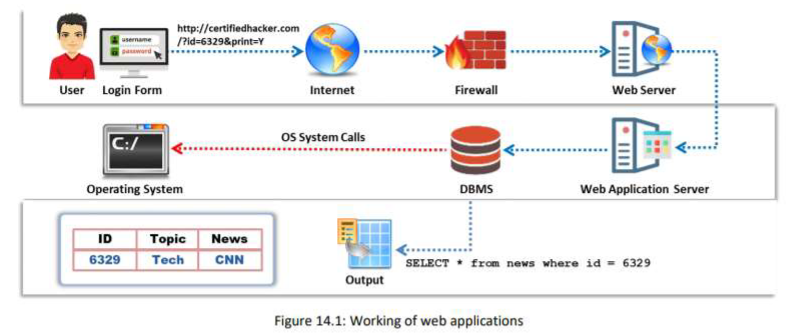
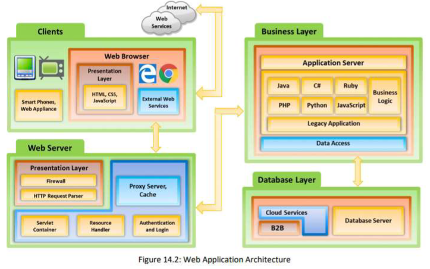
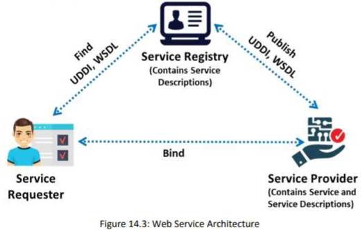
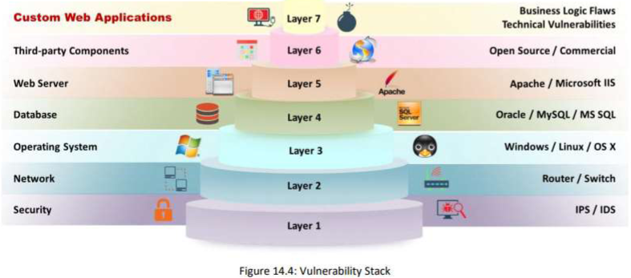
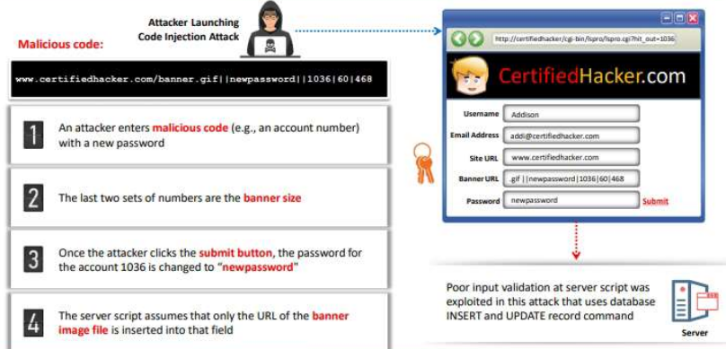
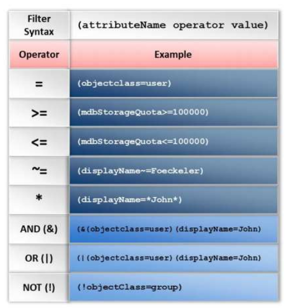
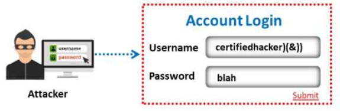
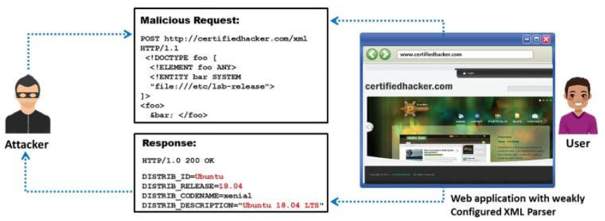

# Hacking Web Applications

## Web applications concepts

Web applications provide an interface between end users and web servers.
They are vulnerable to various attacks such as SQL injection, cross-site scripting, and session hijacking.

### Architecture

Web applications run on web browsers and use a set of server-side scripts to execute the application.

The architecture includes different devices, web browsers, and external web services.
It consists of three layers:

1. client or presentation layer
2. business logic layer
3. database layer

#### Client or presentation layer

It includes all physical devices present on the client side.

#### Business logic layer

It consists of two layers:

- the **web server logic layer** contains various components (firewall, an HTTP request parser, a proxy caching server, an authentication and login handler, a resource handler, and a hardware component, e.g., a server)
- the **business logic layer** includes the functional logic of the web application, implemented with .NET, Java, and "middleware".

#### Database layer

It consists of cloud services, a B2B layer that holds all the commercial transactions, and a database server that supplies an organization's production data in a structured form.

### Web services

W.S. is an application or software that is deployed over the internet.
It uses a standard messaging protocol to enable communication between applications developed on different platform.

#### Architecture

Service providers offer web services. They deploy and publish service descriptions of a web service to a service registry.

Three roles:

- provider
- requester (the browser is a requester)
- registry

Three operations:

- publish
- find
- bind

Two artifacts:

- service
- service description

#### Characteristics of Web service

- XML-based
- coarse-grained service
- loosely coupled
- asynchronous and synchronous support
- RPC support

#### Type of

- SOAP (Simple Object Access Protocol) define the XML format
- RESTful (REpresentational State Transfer) are designed to make the services more productive

#### Components of

- UDDI (Universal Description, Discovery, and Integration) is a directory service that lists all the services available
- WSDL (Web Services Description Language) is an XML-based language that describes and traces web services
- WS-Security (Web Services Security) plays an important role in securing web services. It is an extension of SOAP

### Vulnerability stack

It shows various layers and the corresponding elements / mechanisms / services that make web applications vulnerable.

Attackers exploit the vulnerabilities of one or more elements among the seven levels to gain unrestricted access to an application or the entire network.

## Web applications threats

OWASP Top 10 Application Security Risks 2017:

### A1 - Injections

They are web application vulnerabilities that allow un-trusted data to be interpreted and executed as part of a command or query.

They are prevalent in legacy code.

#### SQL injection

... malicious SQL queries into user input forms.
... is the most common website vulnerability on the Internet.

-> module 15

#### Command injection

... malicious code through a web application.

- shell injection. 
Attacker craft an input string to gain shell access to a web server.
- HTML embedding. 
Attack used to deface websites virtually. Attacker adds extra HTML-based content.
- file injection.
Inject malicious code into system files.

#### LDAP injection

... malicious LDAP statements.

LDAP (Lightweight Directory Access Protocol) Directory Services store and organize information based on its attributes. It is based on the client-server model, and clients can search the directory entries using filters.

To test if an application is vulnerable to LDAP code injection, send a query to the server that generates an invalid input. If the LDAP server returns an error, it can be exploited with code injection techniques.

If an attacker enters a valid username "certifiedhacker" and injects certifiedhacker)(&)), then the URL string becomes (&(USER=certifiedhacker)(&))(PASS=blah)).
The LDAP server processes only the first filter: (&(USER=certifiedhacker)(&)) that is always true, and the attacker logs into the system without a valid password.

> An important defense method against such attacks is to filter all inputs to the LDAP.

#### Other injection attacks

- server-side JS injection
- server-side Includes injection
- server-side Template injection
- log injection
- HTML injection
- CRLF injection

### A2 - Broken Authentication

#### Session ID in URLs

Attackers sniff the network traffic or trick users to get session IDs and then reuse those session IDs for malicious purposes.

Example:

A web application creates a session ID for the respective login when a user logs into http://www.certifiedhackershop.com. An attacker uses a sniffer to sniff the cookie that contains the session ID or tricks the user into getting the session ID. The attacker now enters the following URL in his browser's address bar:

[http://www.certifiedhackershop.com/sale/saleitems=304:jsessionid=12OMTOIDPXM0OQSABGCKLHCJUN2JV?dest=NewMexico](http://www.certifiedhackershop.com/sale/saleitems=304:jsessionid=12OMTOIDPXM0OQSABGCKLHCJUN2JV?dest=NewMexico)

This redirect him to already logged in page of the victim.

#### Password Exploitation

If user passwords, in database, are not encrypted, an attacker can exploit any user's password.

#### Timeout Exploitation

If an application's timeouts are not set properly and a user closes their browser without logging out from sites accessed through a public computer, an attacker can use the same browser later and exploit that user's privileges.

### A3 - Sensitive Data Exposure

When an application uses poorly written encryption code to securely encrypt and store sensitive data in the database, an attacker can exploit this flaw and steal or modify weakly protected sensitive data.

### A4 - XML External Entity (XXE)

... is a server-side request forgery (SSRF) attack that occur when a misconfigured XML parser allows applications to parse XML input from an unreliable source.
Attacker can a refer a victim's web application to an external entity by including the reference in the malicious XML input.
When this malicious input is processed by the weakly configured XML parser of a target web application, it enables the attacker to access protected files and services from servers or connected networks.

- A5 - Broken Access Control
- A6 - Security Misconfiguration
- A7 - Cross-Site Scripting (XSS)
- A8 - Insecure De-serialization
- A9 - Using Components with Known Vulnerabilities
- A10 - Insufficient Logging and Monitoring

## Web application hacking methodology

## Web API, Webhooks and Web Shell

## Web application security

