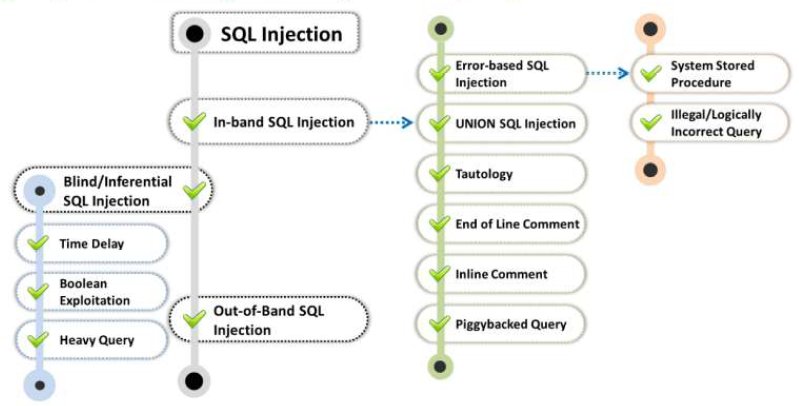
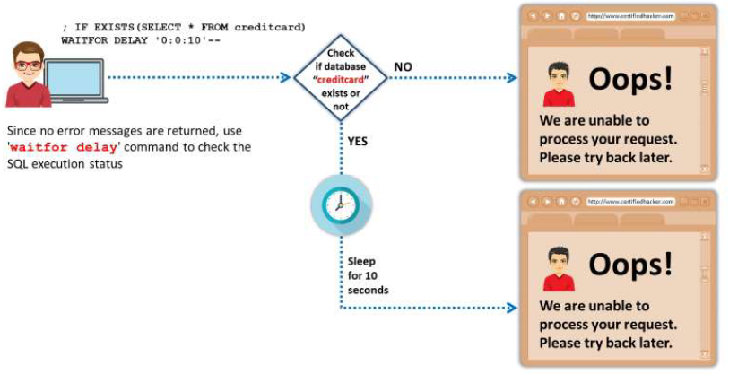
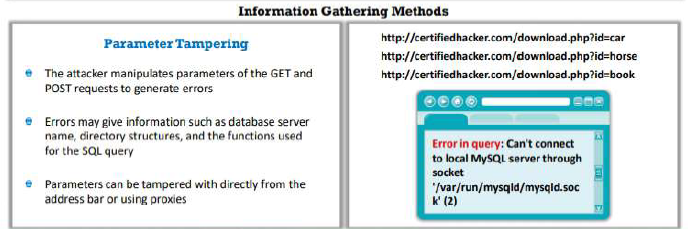
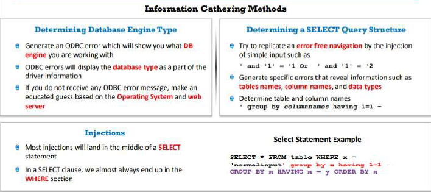
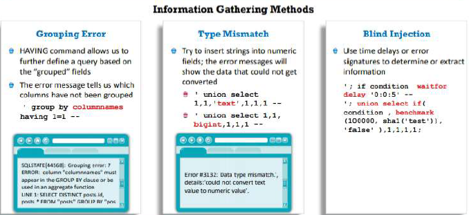
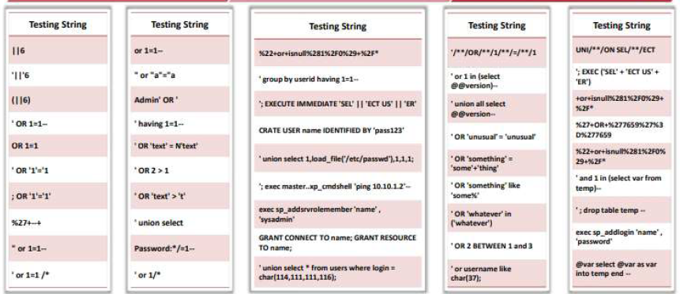

# SQL Injection

## SQL Injection concepts

... is a basic attack used to gain unauthorized access to a db or retrieve information from a db

It is a flaw in web application and not a db or web server issue

It is a major issue for all db-driven websites

... can be used to implement the following attacks:

- **Authentication bypass**: an attacker logs onto an application without providing a valid username
- **Authorization bypass**: an attacker alters authorization information stored in the db
- **Information disclosure**: an attacker obtains sensitive information
- **Compromised data integrity**: an attacker defaces a web page, insert malicious content, or alters the contents
- **Compromised availibility of data**: an attacker deletes the db information, delete logs, or audit information
- **Remote code execution**: an attacker compromises the host OS

All relational db are susceptible to ...

... target websites and web apps that do not follow secure coding practices

### Examples of SQL injection

- on login form
- on search field
- on forgot password form

## Types of SQL injection



### In-band

An attacker uses the same communication channel to perform the attack and retrive the results.

#### Error-based

Intentionally inserts bad inputs into an application, causing it to return db errors.

#### system stored procedure

Exploits db stored procedures.

If the web application does not sanitize the user inputs to dynamically construct SQL statements.

```sql
CREATE PROCEDURE Login @user_name varchar(20),
                        @password varchar(20)
AS
    DECLARE @query varchar(250)
    SET @query = 'SELECT 1 FROM usertable WHERE username = ' + @username + ' AND password = ' @password
    EXEC(@query)
    
    GO
```

If the attacker enters the following inputs in the application input fields using the above stored procedure he will be able to login with any password:

User input: anyusername or 1=1' anypassword

#### illegal - logically incorrect query

For example, to find the column name, an attacker may give the following malicious input:

Username: 'Bob"

The resultant query will be

```sql
SELECT * 
FROM Users 
WHERE UserName= 'Bob"' 
AND password =
```

the db may return the following error message:

Incorrect Syntax near 'Bob'. Unclosed quotation mark after the character string " AND password='xxx".

#### union

An attacker uses a UNION clause to append a malicious query to the requested query.

The attacker checks for the UNION SQL injection vulnerability by adding a single quote character (') to the end of a "php?id=" command (QueryString).

The type of errore message received will tell the attacker if the db is vulnerable to a UNION SQL injection

```sql
-- original query
SELECT name, phone, address
FROM Users
WHERE Id=$id

-- if you set the Id value as:
$id=1 UNION ALL SELECT creditCardNumber,1,1 FROM CreditCardTable

-- the final query is:
SELECT name, phone, address
FROM Users
WHERE Id=1 UNION ALL SELECT creditCardNumber,1,1 FROM CreditCardTable
```

#### tautology

An attacker uses a conditional OR clause such that the condition of the WHERE clause will always be true

```sql
SELECT *
FROM users
WHERE name = '' OR '1'='1';
```

This query will always be true, as the second part of OR clause is always true

#### end of line comment

An attacker uses line comments in specific injection inputs.
The db will execute the code until it reaches the commented portion, after which it will ignore the rest of the query.

```sql
-- you can login to an admin account without the password
SELECT *
FROM members
WHERE username = 'admin'--' AND password = 'password'
```

#### in-line comments

This type of injections allows an attacker to bypass blacklisting, remove spaces, obfuscate, and determine database versions.

```sql
INSERT INTO Users (UserName, isAdmin, Password)
VALUES ('".$username."', 0, '".$password."')"
```

The attacker may provide malicious inputs as follows

UserName = Attacker', 1 /*
Password = */'mypwd

The generated query gives the attacker administrator privileges

```sql
INSERT INTO Users (UserName, isAdmin, Password)
VALUES ('Attacker', 1, /*', 0, '*/'mypwd')
```

#### piggybacked query (stacked queries)

An attacker injects an additional malicious query into the original query.

Attackers use a semicolon (;) as a query delimiter to separata the queries.

```sql
-- original query
SELECT *
FROM EMP
WHERE EMP.EID = 1001 AND EMP.ENAME = 'Bob'

-- the attacker concatenates the delimiter and malicious query

...;
DROP TABLE DEPT;
```

### Blind - inferential

The attacker has no error messages from the system to work on. He simply sends a malicious SQL query to the db.

#### time-based SQL injection

... evaluates the time delay that occurs in response to true or false queries sent to the database



#### Boolean exploitation

Multiple valid statements that evaluate true and false are supplied in the affected parameter in the HTTP request

By comparing the response page between both conditions, the attackers can infer whether or not the injection was successful

Example:

http://www.myshop.com/item.aspx?id=67

An attacker can manipulate the above request to:

http://www.myshop.com/item.aspx?id=67 and 1=2

```sql
-- SQL Query Executed
SELECT Name, Price, Description
FROM ITEM_DATA
WHERE ITEM_ID = 67 AND 1 = 2
```

If the result of the above query is FALSE, no items will be displayed on the web page. Then, the attacker changes the above request to

http://www.myshop.com/item.aspx?id=67 and 1=1

```sql
-- SQL Query Executed
SELECT Name, Price, Description
FROM ITEM_DATA
WHERE ITEM_ID = 67 AND 1 = 1
```

If the result of the above query returns TRUE, then the details of the item with id=67 are displayed.

#### Heavy query

Attackers use heavy queries to perform a time delay SQL injection attack without using time delay functions.

A heavy query retrieves a significant amount of data and takes a long time to execute in the database engine.

Attackers generate heavy queries using multiple joins on system tables.

```sql
SELECT *
FROM products
WHERE id=1 AND 1 
-- this query takes a long time to execute
< SELECT count(*) 
FROM all_users A, all_users B, all_users C

-- the attacker injects the id parameter with
1 AND 1 < SELECT count(*) FROM all_users A, all_users B, all_users C
```

### Out-of-band

Attackers use different communication channels to perform the attack and obtain the results.

1. the attacker needs to communicate with the server and acquire features of the database server used by the web application
2. attackers use different communication channels to perform the attack and obtain the results
3. attackers use DNS and HTTP requests to retrieve data from the db server
4. for example, in a Microsoft SQL server, an attacker exploits the xp_dirtree command to send DNS requests to a server controlled by the attacker.
In Oracle db, an attacker may use the UTL_HTTP package to send HTTP requests from SQL or PL/SQL to a server

## SQL injection methodology

... consists on the following steps:

- information gathering and vulnerability detection
- launching attacks
- compromising the entire target network

### information gathering

1. check if the web application connects to a **db server**
2. list all the **input fields, hidden fields**, and post requests
3. attempt to **inject codes** into the input fields to generate an error
4. try to insert a **string value** where a number is expected in the input field
5. use **UNION operator** to combine the result-set of two or more SELECT
6. check the detailed **error messages** for a wealth of information to execute SQL injection

#### Identifying data entry paths

Attackers analyze GET and POST requests to identify all the input fields, hidden fields, and cookies.

The attacker may use automated tools such as:

- [Tamper Chrome](https://tamper.dev) is a Chrome extension
- [Burp Suite](https://portswigger.net/burp) is a web application security testing utility that allows to inspect and modify traffic between a browser and a target application.

#### Extracting information through Error Messages

You can vary the attack technique depending on the type of errors found.

Methods:







#### Vulnerability detection

There are standard SQL injection inputs called testing strings used by an attacker to perform SQL injection attacks.

These testing strings are widely known as a cheat sheet for SQL injection.


